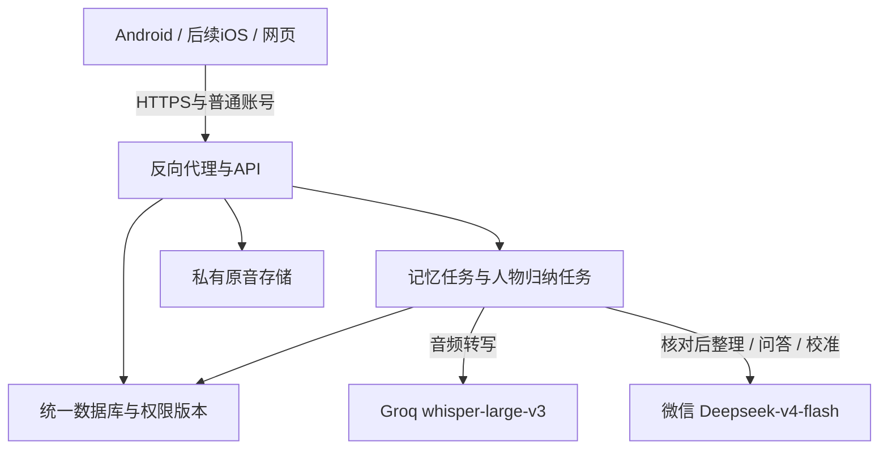

# AWS 资源核对与在线测试版部署分析

2026-10-08。应用基线 `99c2294`，分支 `codex/agent-integration`。本次只读检查 AWS 控制台和仓库，未创建实例、开放端口、上传数据或部署服务；本文件不包含登录密码和模型密钥。

## 一、已经核实的云资源

- 用户提供的 IAM 控制台账号能够正常登录。控制台登录不等于拥有实例系统登录凭据，也不证明所有创建权限或配额足够。
- 默认区域 `us-west-2`（俄勒冈）EC2 列表明确显示没有实例。
- AWS 全球视图扫描完成：列出 34 个区域，其中 17 个为未启用；汇总计算资源 0、存储资源 0。已启用区域未发现 EC2 实例，尚无可直接承载本项目的已创建机器。该结果限于本账号、当前权限和全球视图所覆盖的资源类型，不等于审计了 AWS 全部服务或其他账号。
- 服务抵扣金额页面有一笔活动抵扣金，名称 `2026 November Anker Hackathon`，已发放及预计剩余金额均为 US$200.00，显示已用 US$0.00。
- 控制台显示有效期为 2026/09/01 至 **2026/10/31**。名称中的 November 不应被理解成延长有效期；以显示日期为本次依据，若活动口径不同需向组织方确认。
- 适用服务列表明确包含 Amazon Elastic Compute Cloud、Amazon Simple Storage Service、Amazon Relational Database Service、AWS Data Transfer 等。Groq、微信和小米的外部模型调用不属于这笔 AWS 服务抵扣金。
- 金额页面说明估计值约每 24 小时更新。本月费用概览为 US$0.00，已有一项活动预算，但本次未查看其额度或停止动作。费用为零不等于所有资源永久免费，预算也不能假定是硬停机限额。
- 尚未确认：活动指定区域、实例规格上限、服务创建权限、正式域名、到期后的处理规则以及从 AWS 到两个模型端点的实际连通性。

## 二、产品完成程度

现有证据见 [PRODUCT_ENTRY](PRODUCT_ENTRY_2026-10-08.md) 和 [AGENT_CORE_RESULTS](AGENT_CORE_RESULTS_2026-10-08.md)。

| 方面 | 已证实 | 尚未证实或未完成 |
| --- | --- | --- |
| Android 核心路径 | 模拟器原生录音/暂停/播放、Groq转写、核对与书面补充、微信整理、保存、有来源问答 | 实体设备、真人麦克风、离开PC后的公网运行 |
| 人物与互动 | 人物候选、Owner确认、来源回查、真实校准、授权与撤权循环 | 自动重复/冲突关系建议完整性、稳定人格表现 |
| 更新语义 | Owner审核的ADD/SUPPORT/CONFLICT/CHANGE及版本失效 | 不能称同学完整自动Trait状态机已移植 |
| 质量 | v6完整60问有35项主要要点得到支持，来源/权限机械检查无错误 | 24项质量问题、1项明确漏答；不能声称60/60通过 |
| UI和分发 | Android自然风格和本地debug APK；网页自然花园 | 公网配置与签名交付、完整真机视觉/行为测试；iOS需Mac |

当前可以说“核心流程在本机真实调用条件下跑通”；不能说“用户拿到安装包，在任意网络上就能使用”或“数字分身已经完整准确实现”。此前文档中的“没有服务器/域名”应理解为没有已配置的在线部署目标：现在已核实有可使用的云账号与抵扣金，服务器仍未创建，域名仍未确定。

## 三、建议怎么利用 AWS

先交付一个受控的在线测试环境，集中运行现有统一后端，避免另建第二套业务系统。

- **计算**：一台 Linux CPU 型 EC2 作为首轮容量评估起点，不需要部署本地ASR或购买GPU。API、AI Core适配器、处理worker、人物worker仍为可分别重启的进程。CPU/RAM规格根据依赖加载和少量并发压测确定；本地搜索仍可能加载CPU嵌入模型，不能按“仅转发HTTP”估算内存。
- **模型**：保留已验证的Groq与微信路线，不因AWS可用就自动切换模型供应商。小米用于现有合成测试素材，不是日常录音转写的必经服务。
- **数据库与音频**：仓库真实部署路线为PostgreSQL与S3。测试版可先在同一EC2中运行PostgreSQL，数据落持久卷；原音使用私有S3。是否采用RDS取决于费用和运维需求，不自动开启。不能未经验证把本地SQLite测试结果当作PostgreSQL通过证据。
- **入口**：手机内置真实HTTPS服务地址，使用普通账号登录，不让用户输入开发者token或PC回环地址。网页同域访问；已有UI继续复用。
- **密钥**：模型凭据仅由服务器安全配置提供；AWS服务访问优先实例角色和临时凭据。APK、网页、源码包均不包含模型密钥。AWS控制台密码不作为SSH密码使用。
- **运行**：进程自启动、健康检查、有限重试、磁盘告警、数据库与音频备份恢复必须实际验证。到期前导出和迁移计划与服务部署一起安排。

## 四、这次发现的实际部署差距

1. `services/backend/run_workbench.py` 当前是本地开发启动器，服务监听127.0.0.1，不能照搬为公网生产启动方式。应准备独立Linux运行配置，不破坏当前本机环境。
2. 账号接口检查HTTPS，Cookie接口检查Origin；工作台有主机白名单。代理后的协议/域名、可信代理范围和Cookie Secure必须一致，否则“网页能打开”而登录或请求失败。只信任实际代理，不把所有来源当可信代理。
3. PostgreSQL迁移与真实并发没有完成验收。来源修改/删除/撤权的短事务校验必须在目标数据库重跑，包括序列化冲突处理；迁移副本通过后才能处理正式数据。
4. S3适配代码不等于AWS远端已验收。必须测上传、原音哈希回读、权限过滤、撤权后的旧入口和失败恢复；桶保持私有。
5. 必须在选定区域测Groq、微信两个端点的鉴权、时延、长音频及失败重试，不能把本机网络结果套用于云机。
6. Android应构建预置HTTPS地址的测试安装包，完成公网账号、录音上传、断网恢复、重启与来源播放。iOS另在Mac构建并测试，云部署不会自动完成这项工作。
7. Agent质量独立推进：修复明确漏答，重点回归人物归属、否定、不确定与未知因果；增加改写问题和保留测试集，避免只修固定60题。

## 五、建议执行与验收顺序

1. 确认活动资源限制、域名和预算，准备可审查的资源清单及Linux配置；在本地先验证部署包、PostgreSQL迁移和代理登录。
2. 在获准的区域建立单机测试环境，先用虚构素材验证云端模型与私有存储；不搬运无关个人数据。
3. 构建连接该环境的Android包，实体手机关闭Wi-Fi、使用移动网络，从空账号走完录音→播放→核对/补充→记忆→人物候选→有来源问答。
4. 用第二个账号授权/撤权并重试旧原音与旧答案，至少三轮；重启服务器后复测已保存资料及待处理任务。
5. 分开报告功能是否可操作、回答语义质量、稳定运行与手机体验。到期前完成备份恢复和资源处置安排。

本次没有创建收费资源或执行公网部署。资源创建及公网开放需要在具体区域、规格、预算与访问范围明确后执行；本报告是实施依据，不是已部署证明。

## 参考与可复查入口

- [AWS全球资源视图](https://us-east-1.console.aws.amazon.com/awsglobalview/home?region=us-east-1)（需账号登录）
- [AWS抵扣金](https://us-east-1.console.aws.amazon.com/costmanagement/home?region=us-east-1#/credits)（需账号登录）
- [EC2连接方式](https://docs.aws.amazon.com/us_en/AWSEC2/latest/UserGuide/connect.html)
- [Session Manager前置条件](https://docs.aws.amazon.com/en_en/systems-manager/latest/userguide/session-manager-prerequisites.html)
- [EC2停止和启动](https://docs.aws.amazon.com/AWSEC2/latest/UserGuide/Stop_Start.html)
- [AWS程序化访问凭据](https://docs.aws.amazon.com/us_en/IAM/latest/UserGuide/security-creds-programmatic-access.html)
