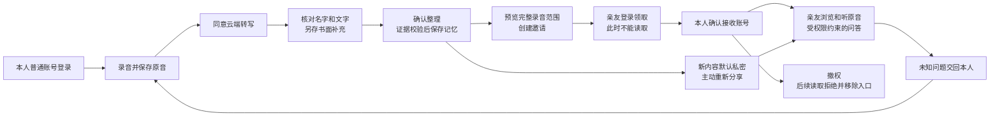

# Android 双角色内测：实施结果与未完成项

> 本文保留10月9日历史基线。10月10日限流恢复后的修复、完整54/60结果、ECS升级及手机验收进展，见 [本轮恢复与交付记录](PAIRED_DELIVERY_RECOVERY_2026-10-10.md)。以下“未切换ECS”不再代表最新运行状态。

**结论：主要接口、邀请和 Android 交互已经实现，但本阶段尚未完成交付。问答完整评测未达门槛，微信接口随后连续返回429，因此没有将候选版本切换到 ECS。**

工作区：`D:/codex_work/remember-me-agent-loop`，分支 `codex/agent-integration`。未修改饮食项目，未 push、merge、开放注册或扩大网络白名单。

## 1. 现在分别有什么

| 对象 | 实际状态 | 不能据此声称的事情 |
|---|---|---|
| ECS 生产服务 | `paraformer-20261009`，四个服务正常运行；数据库仍为 `0014_profile_relations` | 新邀请和第二轮故事组织已上线 |
| 本地候选后端 | 分享预览、单次邀请码、领取、本人批准、拒绝/取消/撤权、已确认接收人、普通账号维护均实现 | 云端端到端已经验收 |
| Android | 分享界面、普通账号、能力兼容、角色内容及撤权清理已实现；延续现有自然主题 | 所有屏幕/大字体/后台行为都已在真机通过 |
| 签名内测 APK | 0.7.0-internal，默认 IP HTTPS；实测登录、原音播放/暂停/定位和退出 | 候选包连到旧 ECS 就能使用新版邀请 |
| 双设备 | 两个独立模拟器、普通账号、隔离本地后端，三轮18阶段通过 | 真机或 ECS 双设备全过程通过 |
| 新版事实问答 | 完整v10为53/60合格；v11被429中断；v12冷却实现有单元测试 | 54/60门槛已经达到，或新实现已经在云端启用 |

服务器是实际后端，本地验收也是实际后端；两者数据和版本不同。测试凭据、模型密钥、运行数据库与音频未放进 Git。

## 2. 已完成的实现

### 账号、分享与权限

- `/api/v1/service-info` 返回版本、注册和邀请能力；Android只对旧服务缺少此新增接口的404使用兼容状态，不吞掉鉴权、限流或服务器错误。
- 完整录音分享预览，跨录音故事展开全部来源；用户单独确认整段原音范围及云端问答权限。
- 随机邀请码24小时有效，服务端仅存哈希；登录后领取仍然没有阅读授权。
- 本人核对账号后批准，短事务重新核验资料版本与所有权，原子建立全部授权；重复批准幂等。
- 邀请范围快照显示录音标题、时间与来源；旧的缺少范围快照的待批准记录要求重新预览。
- 再次分享可使用已确认亲友；仍须预览并明确批准。新录音/回答/修订不自动扩大分享范围。
- 邀请撤权只撤销这一批新建的授权，不误伤此前独立授权。音频、故事、问答及人物材料继续共用原有权限系统。
- 管理员账号创建/重置命令复用密码规则；重置撤销旧会话，并保护正在校验旧密码的并发登录。
- Android退出、身份切换和失去权限后清理数据及播放状态，防止迟到响应恢复旧内容。

### Agent 可靠性

修复了原文材料构造中的确定性缺陷：不能从句子中扣除一个已提取片段后，把剩余的否定词与事实拆开。部分提取时保留完整有效句子；涉及失效片段时不能为补齐上下文重新引入失效内容，第三方转述不升级成本人经历。

候选事实问答采用“模型选择来源编号 → 程序复制有效原文 → 语义审阅 → 返回前复核版本”。这限制了模型随意改写事实，但**逐字引用不保证选段完整，也不保证ASR和历史事实正确**。风格化表达默认关闭。

v11增加暂时性传输失败的一次有界重试，选择、修复、审阅、重试共同最多3次模型请求，预留审阅预算。v12进一步区分429：遵守数值Retry-After，没有有效数值时冷却60秒；冷却期不再向上游发请求。鉴权、截断、无效JSON、语义不合格不被包装成成功或UNKNOWN。

## 3. 实际验证记录

| 检查 | 结果 | 原始记录位置（相对工作区） |
|---|---|---|
| 后端全量 | 447通过、3跳过 | `services/backend/var/paired-materials-final.xml` |
| AI Core最终代码 | 263通过 | `services/backend/var/paired-ai-v12.xml` |
| Android单元测试 | 47通过 | `services/backend/var/paired-delivery` 中构建/测试记录及 Android 测试输出 |
| PostgreSQL材料/邀请/并发 | 最新一组48通过；此前38、43通过 | `services/backend/var/paired-delivery/postgres-context-v10.xml` |
| 非调试签名 APK → IP HTTPS | 普通登录、取故事、真实原音播放、暂停/定位、退出通过；11.951秒 | `services/backend/var/paired-delivery/internal-ip-result.json`、`internal-startup-fixed-test.log` |
| 两个独立模拟器 | 3轮×6阶段全部通过 | `services/backend/var/paired-delivery/two-device-local-result.json` |
| 备份恢复 | 独立数据库恢复并升级0016；12个原音逐一哈希一致 | 服务器 `/var/lib/remember-me/backups/paired-20261009T131348Z` |
| 服务账号迁移路径 | 使用rememberme的Unix认证在独立测试库升级到0016成功 | `services/backend/var/paired-delivery/peer-migration-check.log` |

双模拟器每轮为：生成邀请 → 亲友领取且原音404 → 本人批准 → 亲友播放且实际位置超过1秒 → 本人撤权 → 亲友原音404并移除故事。两个模拟器数据目录独立，使用两个普通账号。测试用ADB只转发隔离本地8892接口，结束后均移除；它不是“脱离电脑”的最终云端验收。临时第二台模拟器已关闭。

另外，签名APK的单账号ECS播放检查走真实公网IP HTTPS，**没有**SSH隧道或ADB reverse；这只能证明该检查，不能与上述本地双设备结果拼成云端全过程通过。

### 完整问答评测

较新的完整云转写语料仍是原30段音频：哈希30/30一致；其中24段历史codestral-2508、6段历史Groq whisper-large-v3。此次没有重新调用ASR，不能称为Paraformer结果。旧Whisper材料另保留，没有用创作稿或gold替换转写。

| 运行 | 覆盖 | 结果 | 判定 |
|---|---|---|---|
| v10，完整云转写语料 | 60/60 | 55个响应；53题合格、7题失败；已审阅60题 | **未过54题门槛** |
| v11，同一语料 | 35/60后中止 | 12个响应未完整语义审阅、23个接口失败、25题未运行 | 连续HTTP429，不能视作完整结果 |
| v12 | 确定性测试 | 冷却、调用预算、鉴权与无效输出边界通过 | 未完成真实60问 |

v10逐项审阅发现的失败：

| 题目 | 原因 |
|---|---|
| bus_driver-q10 | 只有“他”的指代，未说明具体是谁 |
| bus_driver-q16 | AI_SCHEMA_INVALID |
| firefighter-q10 | 提到赵宁，但未区分两个同名人物的关系 |
| firefighter-q16 | 真实传输超时，返回TWIN_UNAVAILABLE |
| firefighter-q19 | AI_SCHEMA_INVALID |
| life_review-q10 | AI_SCHEMA_INVALID |
| life_review-q19 | 真实传输超时，返回TWIN_UNAVAILABLE |

该轮技术审阅未发现捏造引文、隐私泄漏、关键事实颠倒或失效事实复活；这不等于不存在未发现的问题。合格判定容许用户先前允许的非致命同音字形瑕疵，但不容许混淆同名人物、编造关系或反转否定。诸如梁舒/梁叔、灰伞/灰散仍待本人核对，长引文可读性也未解决。审阅是助手基于文字证据的技术阅读，不是人工听读、真人本人认可或独立留出集评测。

逐题原始结果、依据及判定分别在 `services/backend/var/round-two/qa-quotes-v10-cloud.json`、`review-quotes-v10-cloud.json`、`audit-quotes-v10-cloud.csv`；失败没有被后续重跑覆盖。v11另存，未拼接成绩。

## 4. APK与部署边界

- 候选安装包：`services/backend/var/paired-delivery/remember-me-0.7.0-internal-candidate.apk`。
- 包名：`me.remember.app.internal`；版本0.7.0-internal；原生应用源码构建基线29e7496；此后改动为AI、部署与测试工具，未改变该APK内的应用实现。
- SHA-256：`0f5238088f99be30df5dce8c4614a70da845e71ffb6ebf80c5442cd006372d3f`。
- 默认 `https://39.108.183.47`；非debuggable；固定内测签名，仅对该IP信任测试证书，不关闭TLS验证。证书到期2027-01-07。
- APK扫描未发现三份指定模型密钥的实际值；不把这一检查声称为完整安全审计。
- 旧ECS不支持新版邀请时，App显示能力不可用；不能将这个候选包发作“已完成双角色交付版”。

迁移工具已修正Unix peer认证：由既有服务账号连接/执行，不更改数据库认证规则或授予root额外数据库权限。账号配置工具先检查0016迁移，旧生产库0014时拒绝创建本次交付账号；当前两个专用ECS账号尚未创建，旧账号未重置。前期尝试均事务回滚，已核对专用账号数量为0。

正式部署仍按：冻结质量报告 → 新鲜备份及隔离恢复 → 新目录迁移 → 服务就绪/模型连接 → 云端双角色冒烟 → 相同APK验收。候选目录存在不等于完成部署；回退保留数据库与原音，不清库、不倒灌旧备份。

## 5. 还差什么，按什么顺序完成

1. **恢复模型服务条件。** 确认微信接口429是配额还是限流及恢复时间；无需再次粘贴密钥。等待后的一次短请求仍429，已停止批次，没有继续高频请求或换服务商。
2. **通过质量门槛。** 明确可用限额后冻结实现，受控完整跑60问、逐项审阅；修好人物指代与结构失败，至少54题且关键错误零。不能只补跑失败题拼成绩。
3. **统一ECS与App。** 通过后重新备份恢复，部署同一候选版本，执行0015/0016增量迁移，配置两个普通账号，走完整Paraformer/核对/整理/邀请/问答/补录/重新分享/撤权。
4. **补齐关键更新循环。** 修改后再问、补录后重新分享、生成期间资料变化，须在统一云端/手机版本再测；当前数据库并发用例及本地三轮撤权不能代替全部旅程。
5. **实体手机。** 当前没有接入实体Android。需至少一台真机完成麦克风、拒绝权限恢复、暂停继续、后台保存、断网/重启、定位和身份切换；业务不能走电脑转发。

大字体/减少动态效果全旅程、iOS编译与真机、任意网络、公众注册、长期存储备份演练、真人亲友评测仍单列待验证。当前没有给这些项目填“通过”。

## 6. 使用流程与后台对应关系

这是交付目标与已实现规则的对应图，**不是整条云端旅程已验收的声明**。记录者掌控材料，亲友只能依据获授权资料了解这个人；系统回答、亲友的问题和系统归纳不自动变成本人原话。
