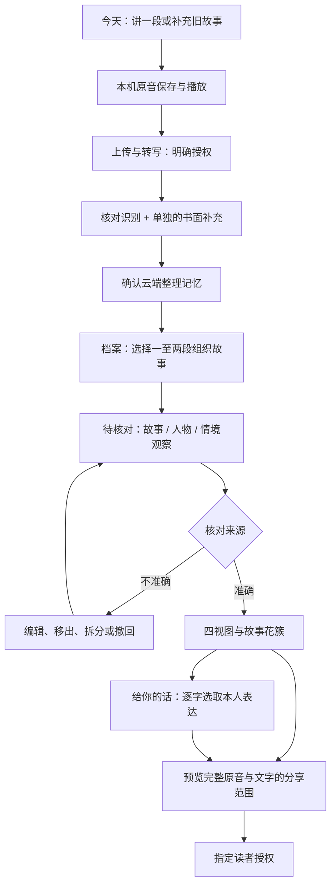
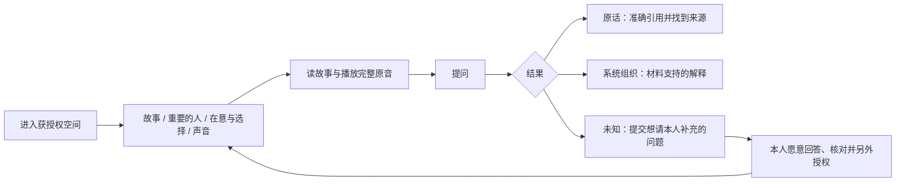

# 第二轮手机体验与共享接口交接

状态：2026-10-09 本地评估版本。Android 已接实际服务；iOS 本轮为设计与接口交接，未编译、未设备验收。自然配色、勿忘我品牌、背景与局部材质沿用 PR #85，不另建一套视觉语言。

## 用户旅程：留下的人

原音保存、转写完成、记忆提取成功和人物理解确认是四件事。按钮与状态分别说明，不把“生成草稿”显示为“已了解本人”。

## 用户旅程：接收记忆的亲友

一个人的提问不是事实，也不自动获得新回答录音的授权。读者不能编辑、确认理解、设置表达风格或查看所有者修改历史。

## 页面与原生组件

| 位置 | Android 当前接入 | iOS 对应设计与约束 |
|---|---|---|
| 底部入口 | 今天 / 档案 / 对话 / 我的 | 保持相同顺序，原生 TabView；不增加八个标签 |
| 档案 | 录音 / 记忆 / 人物 | 原生分段选择；返回保留位置 |
| 人物 | 人生足迹 / 重要的人 / 在意与选择 / 声音与表达，两列自动换行 | 大字时使用两列或可访问的选择器，选中状态必须有文字/形状提示 |
| 故事条目 | 标题、发生时间原文、情境正文、展开依据 | 长文使用稳定表面；时间模糊则保留原文，不画精确日期点 |
| 本人感受 | 人生足迹中的单独筛选 | 同样提供筛选；无材料不补情绪曲线 |
| 核对与工具 | 待核对数量；整理/寄语工具默认折叠 | 主内容先出现，工具单独面板，不堆叠所有操作 |
| 来源 | 引文、来源类型、完整原音 | 系统播放器控件，明确无逐字音频对齐 |
| 修改历史 | 原生弹窗查看版本与内容 | Sheet 查看；编辑、拆分、恢复都重新进入待核对 |
| 表达与寄语 | 精确原话 + 默认关闭的风格开关 | 寄语不可自动扩写；“收信人”只是标签，不等于授权账号 |
| 提问 | 基础答案和可选风格文本分别标记 | 保留基础答案；风格不可用仍可读有依据的答案 |

触控不小于 Android 48 dp / iOS 44 pt。长文本自动换行；操作组换行，不让关键操作藏在多层横向滚动里。主操作固定可到达。图片只提供氛围，不作为历史照片或人格准确率。减少动态效果仍须能理解状态。

## 共享接口

根路径 `/api/v1/workbench/subjects/{subject_id}/narrative`，沿用服务端身份解析、整段故事授权和 CLOUD_TWIN。接口新增字段见 `packages/contracts/schemas/narrative-draft-v1.schema.json` 与 `narrative-overview-v1.schema.json`。

| 请求 | 含义 |
|---|---|
| GET 根路径 | 当前角色、四视图、八维计数、可見来源、理解、风格设置、一个补问 |
| POST /suggest | 明确云端授权 + episode_ids；返回实际异步 job_id，不填假进度 |
| GET /jobs | queued / running / complete / failed；失败保留原音与先前结果 |
| POST /records | 新建待核对记录，可选多个真实来源 |
| PUT /records/{id} | 携带 revision；编辑后 pending |
| POST /records/{id}/confirm、reject、undo | 版本校验；undo 恢复旧内容后重新核对 |
| POST /records/{id}/split | 只移动原记录的部分来源；两条都回 pending |
| GET /records/{id}/history | 仅本人可查看审计历史 |
| PUT /style | enabled + revision；只能用本人已确认的原话范例 |
| POST /next-question | snoozed / declined；稍后24小时，不主动发通知 |

404 隐藏不属于当前身份的内容；409 说明资料/设置已变化，刷新后由用户决定重试；422 说明输入或引用不成立；模型未通过检查返回失败，不伪装成“没有材料”。风格失败不覆盖已成功的基础答案。

## 当前限制与后续验收

- 人生足迹目前是带原文时间的故事列表，还未完成成熟的人生阶段总览；不是自动排序的完整人生时间线。
- 人物确认支持同一条人物记录的多个原文称呼；没有部署自动实体合并。跨故事关系详情与照片线索入口还需深化。
- 读者只看到全部依据可见的已审核观察；尚未实现针对读者材料独立调用模型重新归纳。
- 主动补问可以提出、暂缓、拒绝；亲友问题沿用现有录音关联。冲突问题的解释到理解更新仍需本人手动处理候选，没有自动推断完成。
- 网页花簇绑定已确认 story ID；Android 目前优先可操作列表与来源，未移植网页连续镜头花园。
- 实体 Android、iPhone、VoiceOver/TalkBack 完整旅程、5组本人—亲友任务和本人风格认可仍需实际参与者与设备。不得由模拟器/合成故事代替。

## 运行与迁移

后端追加 `0015_narrative`，不重写旧音频、转写、六类记忆与七个人物领域。独立验收用 `tools/round_two/serve.py` 在原 SQLite 的备份上升级，端口8890/8891；旧8877与ECS不变。

微信事实回答检查默认开启 `AI_TWIN_VERIFY_ANSWERS=true`：SIMULATION/UNKNOWN 增加一次同模型审查；ORIGINAL 仍由原文选择与逐字校验产生。模型审查不是准确性证明，失败不会秘密重试或改成UNKNOWN。单次外部请求45秒；基础回答最多两次调用，可选风格另有两次。客户端网络等待上限210秒；正式接入反向代理时相应设置总请求时限，长期应改为可取消的异步问答任务。

Android 调试包不含模型密钥。连接本机验收用 `adb reverse tcp:8890 tcp:8890` 并在连接设置指定 `http://127.0.0.1:8890`。这份包不是已部署第二轮ECS的开箱即用发布包。iOS 必须等服务能力开关 `narrative=true` 才打开新入口；旧服务保持原界面并说明功能不可用。
