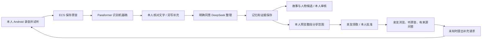

# 勿忘我 · 10 月 10 日四人会议交接

本文件是本次同步的阅读入口。**已交付的是受限网络内、Android 模拟器连接真实 ECS 的双角色原型；不是已经完成质量验收和双端上线的产品。** 本次同步代码、测试、设计资源及 19 张实际截图，不迁移本机私人数据库，不附带账号密码、模型密钥或签名私钥。

先看 [19 张按顺序排列的截图](screenshots/2026-10-10/README.md)，再看 [安装、启动与复验](TEAM_RUNBOOK_2026-10-10.md)。[当日逐步实跑记录](MEETING_DEMO_2026-10-10.md)保留每一步证据和失败经过。

## 1. 本次同步什么，为什么选这一版

| 项目 | 固定基线与采用范围 | 边界 |
|---|---|---|
| 团队集成基线 | `develop@4dc3d5a`，本次 fetch 后未变化 | 没有覆盖团队 develop/main |
| 已开发的共享后端和 Agent | `6ca7244` 及其之前的 41 个本地提交；运行核心与 ECS `c2e17fc` 一致，之后为交付文档/工具 | 一次交接范围较大，下表提供分模块审阅路线；不是要求一次无审阅合并 |
| 最新 Android 增量 | 八维/四视图入口、候选与已确认内容分开、来源展开、核对提示、问答收键盘、旧授权布尔/数字兼容 | 本次 19 张截图使用此套客户端；不需要最新的实验后端才能使用核心流程 |
| 同学 Agent 思路 | 固定 `8627f03` 的情境、支持/反例、原文问答、先锁后答，以及经适配的 ADD/SUPPORT/CONFLICT/CHANGE 审核 | 没有整条移入另一套 Trait 数据库；自动关系判定和去重还不成熟 |
| UI #85 | 本分支 `d14d1d0` 已移植 `efaa9ec` 的自然色、品牌及双端资源 | 网页花园与原生手机呈现不同；iOS 本次未编译 |
| 远端新增工作 | PR #88 `6f1330e`；PR #86 新头 `0026237`；PR #87、#85 保持独立 | 已记录，没有自动合入。#88 的本地 STT 不替代当前服务端 Paraformer 主线 |

远端关联：[UI #85](https://github.com/ztjklt/Remember-Me/pull/85)、[iOS #86](https://github.com/ztjklt/Remember-Me/pull/86)、[Agent #87](https://github.com/ztjklt/Remember-Me/pull/87)、[后端复用 #88](https://github.com/ztjklt/Remember-Me/pull/88)。这些 PR 的代码不能因为标题相近就互相覆盖。

**留在原工作区、未随本次交接提交的实验**：10 月 10 日新增的 semantic grounding 审阅、长句限定保护新提示词、ASR 分段/警告后端、v2 自然口述语料、网页新人物展示及其试验输出。它们值得继续做，但尚无完整的同版本实跑结论，不能借本次截图宣称验收。Android 对可选 `review_warnings/paragraph_preview` 字段的兼容读取保留；服务器缺少它们时不显示该功能，不自动改写文本。

不提交 APK 大文件、原始日志、私密账号文件、模型权重、数据库、TTS 批次原音或本地截图网站。19 张 PNG 为原图顺序复制，附哈希清单，未重画或美化成功结果。

## 2. 用户现在实际能够做什么

**本次实际点击到**：普通账号登录 → 开始/暂停/继续录音 → 本机试听 → 直接上传 ECS → 机器转写 → 技术核对 → 3 条真实模型记忆入库 → 故事与云端原音 → 有来源问答 → 人物整理任务及候选依据 → 创建邀请 → 亲友领取 → 本人批准 → 亲友播放 → UNKNOWN → 亲友请求与本人收到请求。

输入是小米合成的虚构短语音，通过模拟器麦克风接口由 Android 录音器实际录下约 20.8 秒；**不是实体手机真人录音**。没有用创作稿替换 ASR。业务直接走 App → ECS IP HTTPS，电脑不承担 ASR 或业务转发。

本次“收到亲友问题”之后的新补录、重新分享、纠正、撤权，没有在同一截图旅程继续重跑。它们有较早的云端接口和双模拟器验收，见 [分层历史记录](PAIRED_DELIVERY_RECOVERY_2026-10-10.md)，不要把历史检查混称为这 19 张图片全部证明的操作。

### 服务器实际运行的内容

- `remember-me@api`：账号、空间、上传、核对、邀请、权限、故事及结果接口。
- `remember-me@worker`：转写、核对等待、模型提取和保存等后台阶段。
- `remember-me@profile`：人物候选、故事组织等后台整理任务。
- `remember-me@ai`：微信 DeepSeek 的提取、来源问答、人物/故事整理和校准适配及校验。
- PostgreSQL、原音存储、HTTPS 入口为上述流程提供持久化和访问能力；推送代码不等于重新部署、重建这些资源。

本次只读复核：`/opt/remember-me/releases/paired-c2e17fc` 仍为当前目录，四服务均 active。本次没有切换 ECS、扩大白名单或开放注册。没有业务电脑中转，不代表任意网络都能访问。

## 3. 记忆、画像、Agent 分别做到了哪一步

**记忆不是把对话历史塞进提示词**：保存原音、机器稿、核对稿和独立书面补充；从确认材料提取结构化条目，关联 Evidence，再按版本和授权构造问答材料。原始六类 Memory 枚举保留，八个内容维度是其上的多标签组织，不是八套事实库。

| 展示层 | 当前能力 | 仍需解决的核心问题 |
|---|---|---|
| 八个侧面 | 经历、关系、身份、习惯方法、价值理由、感受状态、愿望牵挂、原话表达可筛选和计数 | 归类覆盖不等于提取完整；不应为填满八格编造内容 |
| 四个人物视图 | 人生足迹、重要的人、在意与选择、声音与表达；候选/确认分开，可展开来源 | 跨录音故事组织、人物身份归属、条件和例外的质量尚不稳定 |
| 人物更新 | ADD/SUPPORT/CONFLICT/CHANGE 有人工审核入口、版本与失效保护 | 还不是同学完整自动 Trait 状态机；重复同一故事不应当成独立印证 |
| 在线 Twin | 在有权材料中选择/组织回答；ORIGINAL/SIMULATION/UNKNOWN，返回后复核版本 | 会漏答、过度拒答、截断限定；增加一次审阅并不能保证消除这些错误 |
| 补问与校准 | 问题单、本人处理、先锁定 Twin 再收本人答案；报告不自动改事实 | 完整双角色长周期体验和手机校准仍需专项验证 |

一套在线问答核心加后台整理任务的形态已经实现。**尚未训练出完整人格，也不能用花朵数、录音数或候选数表示“像本人程度”。** 本次短例新增的是一条待核对的情境观察，其他视图可能为空，不能拿它代表四份成熟画像。

## 4. 已知效果与瓶颈：不要只把问题归结为模型不够聪明

历史冻结版本 v15 的 60 问结果为 **54/60 整题合格**，并非此次重新跑出；6 道失败完整保存在 [逐题表](PAIRED_DELIVERY_RECOVERY_2026-10-10.md)。含有材料却 UNKNOWN、两个请求校验失败、妻子身份上下文漏答、引文截断后面的限定。它是开发集和合成材料技术检查，不是用户准确率。

本次新截图另暴露出：ASR 末句缺少宾语；3 条记忆偏逐句保存；短材料无法形成丰富故事；问答等待出现约 30 秒、49 秒。调用成功与内容合格必须分别报告。

| 大问题 | 原因层次 | 应怎样推进与验收 |
|---|---|---|
| 事实进入系统时就不完整 | 创作语料生硬、ASR 丢字、核对未发现 | 改善自然口述材料；标注原音/ASR/确认稿差异；听原音修名字、否定与限定，不用原稿暗中补 ASR |
| 有引文仍可能理解错 | 引文与完整句意不等价；主体、时间、否定或条件在相邻句 | 选段带上下文；结论逐项关联证据；不完整就待核对或 UNKNOWN，而不是补造 |
| 记忆碎片多、人物理解弱 | 提取条目、故事聚合、人物实体关联尚未充分衔接 | 稳定故事/事件标识；同一事件复述不累计支持；条件、例外、变化显式呈现 |
| 累积材料后成本和延迟上升 | 全量有效文本和多次审阅；当前小样本路线有 24,000 字符上限 | 测量材料量/延迟/调用成本；比较完整有效全文与带权限的分层检索，不静默截断，也不先上图数据库 |
| 纠正、撤权、派生缓存必须一起生效 | 原音/记忆/画像/答案是依赖链，只有删除一行远远不够 | 单一事实源、来源版本与权限版本、任务幂等、失效传播和重启恢复；不并行维护两套权限库 |
| 手机可演示但交付还受环境限制 | 白名单、IP 测试证书、管理员账号、真机/iOS 未验收 | 分别验证网络、身份、后台/断网/重启、证书更新和双端旅程，不能从模拟器通过推定真机通过 |

判断是系统还是模型的问题，要对同一道题固定材料、权限、版本和输出规则：①检查 ASR/确认稿是否含事实；②检查事实是否进入当前有效材料；③检查检索/选段是否送到模型；④检查模型理解和生成；⑤检查审阅/发布是否错误放行或拒绝。之后才用同样输入比较另一模型。换更强模型可能改善④，但不能修复错误输入、遗漏材料、权限和缓存问题。本次没有自动换供应商。

## 5. 四个人怎样分工：四条可以独立验收的工作线

下面是**会议待认领的职责包**，不是擅自改动团队现有人事安排。刘修贤仍牵头 Android，张天霁仍牵头 iOS；另外两项由会上明确认领，再开小 Issue。每项都要有实现负责人和另一位复核者。

| 工作包 | 主要职责与代码入口 | 第一项交付 | 验收 / 与其他人的接口 |
|---|---|---|---|
| A：记忆与人物理解可靠性 | AI Core、语料和评测；`services/ai-core/app/{providers,narrative,profile_proposals,quoted_twin}.py`；复核 #87 | 修复完整语义与证据选段；自然口述小样；展示“经历→条件化理解→例外→本人纠正”的实例 | 固定输入/来源/模型；分别交付事实保留、人物理解、问答三张结果表与实例截图。定义输出建议，**不能绕过本人确认直接写事实** |
| B：记忆生命周期与云端交付 | Backend、契约、迁移、权限、任务与运维；`services/backend/app`；评估 #88 可复用部分 | 将故事/证据/人物版本及纠正/变化/撤权依赖讲清并补测试；统一可重复部署清单 | PostgreSQL 并发、重启/重试、失效传播；旧数据可读、可恢复、无跨身份材料。提供稳定共享接口给双端 |
| C：Android 完整用户体验 | 原生录音、故事/八维四视图、来源、邀请、补问与恢复；`apps/android` | 真实手机从新录音到亲友查看，补录→再分享→撤权；截图+安装包 | 保留自然视觉语言；大字、返回、后台、断网、播放、账户切换均有结果。不在手机放供应商密钥 |
| D：iOS 对齐与双端体验验收 | 在 #86 现有工作线上接同一接口与语义；`apps/ios` | 先完成登录→录音→核对→整理→来源播放，再接人物与双角色分享 | Xcode 构建与真实设备证据独立记录；共同检查两端用户文案和同一内容的显示差异，不再自建另一套事实规则 |

**推进顺序**：会议认领接口/问题 → A、B 先固定最小数据语义和测试 → C、D 并行接同一个稳定后端 → 用同一虚构双角色故事完成联合验收。每次只改一个可验证的闭环，不让四个人同时修改同一字段或同一迁移号。

## 6. 下一阶段的“亮点”应以什么结果呈现

1. **一个故事逐渐完整**：第一次讲述、后来补充、纠正年份、后来变化显示成有来源的故事链；不是录音文件越多就越来越了解本人。
2. **理解可以解释和撤回**：一句“在某情境下重视家人安心”，展开支持经历、例外和本人确认；与笼统人格标签形成区别。
3. **亲友问题让故事继续生长**：不知道→本人补录→本人主动分享→亲友听到原声并再次问到。系统回答不反向变成记忆。
4. **给指定亲友的话**：把真实留言和接收人置于清楚的入口，分享仍由账号授权决定；系统不扩写寄语或代本人作新承诺。

先用现有数据真实展示这些改进，再考虑意境图、表达风格等扩展。生成插画必须标注创作属性；风格化回应默认关闭，不能为熟悉感牺牲事实边界。

## 7. 可借鉴的研究与开源路线（尚未集成）

- [LongMemEval 论文](https://arxiv.org/abs/2410.10813)：借用信息提取、跨会话、时间、更新、拒答五类评测能力；我们的 60 问仍称项目自建开发集，另留未调提示词的测试集。
- [Mem0 官方仓库](https://github.com/mem0ai/mem0)：研究记忆层与读取/更新/删除接口、处理成本；它不替代本项目的证据、整段授权和本人确认。先做隔离比较，不把数据库整体迁过去。
- [Graphiti 官方仓库](https://github.com/getzep/graphiti)：借鉴关系有效时间、历史和变化表达；先在当前关系表中说明事件时间/记录时间/失效时间，再证明是否有必要采用图存储。不能把“使用图数据库”当成理解能力已解决。

这些是工程参考和评测参考，不为“八维四视图”提供心理测量背书，也不承诺某开源框架会消除幻觉。

## 8. 今晚会议建议的决策顺序（20 分钟）

1. 5 分钟按 19 张截图讲清真实旅程和边界。
2. 5 分钟看本次采用/暂缓清单，确认 #85/#86/#87/#88 与本分支的关系，避免覆盖与重复开发。
3. 7 分钟认领 A–D 的一个最小交付、接口负责人及复核者；将大模块拆为可验收小 Issue。
4. 3 分钟确定下次联合演示：同一故事从新录音、核对、人物理解到亲友补问、再分享和撤权。明确仍缺真机、iOS、长期素材与独立质量评价。

推送后可先以交接分支继续审阅和分工；只有确定具体兼容范围后才合并。推送、PR、部署和发布是四件不同的事，本次只执行前两件。
