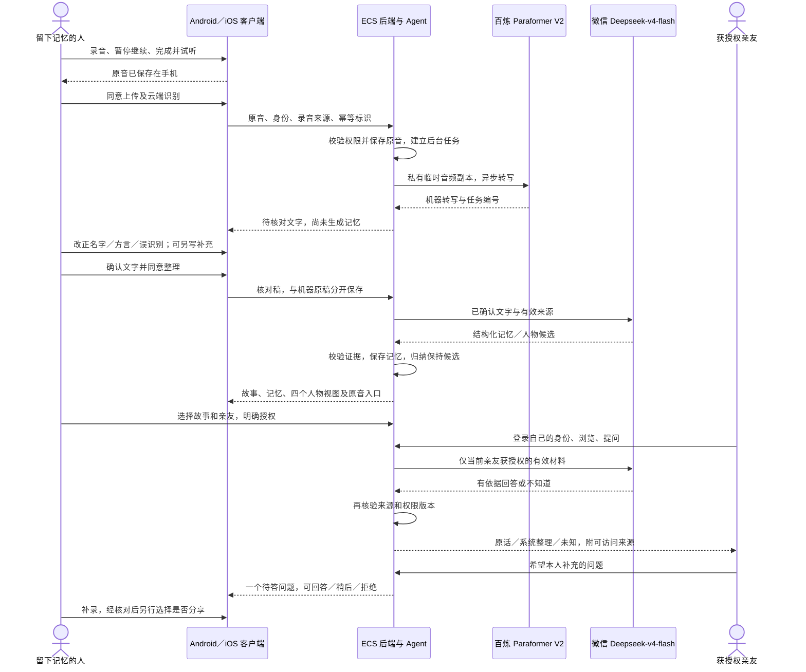

# 勿忘我：从手机讲述，到亲友聆听

## 产品中的分工

手机保留录音、暂停/继续、播放、核对输入和交互界面；ECS 负责身份、权限、原音存储、后台任务和 Agent 的状态。百炼负责语音识别；微信 Deepseek-v4-flash 负责经本人确认后的记忆整理、人物候选和有来源的回答。ECS 调用这些模型，并非在这台 CPU 服务器上训练或运行模型权重。

模型密钥不交给手机。手机持有自己的登录会话，通过 HTTPS 请求 ECS；服务器判断当前身份能访问哪些材料。云端功能需要联网，本机原音可以先保存，失败不会被当作整理成功。

图中的 Android／iOS 表示共享产品路径，不代表 iOS 已完成本轮编译或设备验收。当前交付和联调优先 Android。

## 记录者的旅程

| 阶段 | 用户看到、做什么 | 背后发生什么 | 失败与控制 |
|---|---|---|---|
| 进入 | 用账号登录自己的空间 | 服务端解析身份与所有权，不用开发者 token 手动认领别人空间 | 换身份清缓存；空间默认私密 |
| 讲述 | 今天页开始录音，暂停/继续，结束试听 | 手机实际录音并落盘，服务器尚未调用模型 | 麦克风未授权时提示；原音不依赖云端处理成功 |
| 识别 | 确认上传完整原音，看到处理状态 | ECS 保存原音；百炼私有临时副本有效期48小时；异步任务记录编号 | 识别失败原音保留；查询超时继续同一任务，不伪造进度 |
| 核对 | 改名字、生僻字或误识别，必要时写补充 | 机器原稿不可被核对稿覆盖；补充文字单独注明来源 | 此前不调用记忆提取；可先离开、之后核对 |
| 整理 | 明确确认云端整理 | DeepSeek 提取结构化材料，后端校验引用、保存、更新人物视图 | 引文不存在、JSON无效或截断会失败，不能发布为成功 |
| 理解 | 看人生经历、重要的人、在意与选择、说话与表达 | 同一批证据的四种视角；跨故事归纳先是候选 | 本人确认／拒绝；单个故事不等于稳定人格 |
| 补充与纠正 | 从目标记忆继续录；选择补充、纠正、情况变化 | 保留修订历史，旧错误退出当前有效材料；时间变化保留前后关系 | 模型不能擅自覆盖；新修订默认不分享 |
| 分享 | 选择故事和具体亲友 | 授权覆盖整段原音、完整核对文字和对应记忆 | 页面必须说明范围；撤权阻止后续读取，不能收回已看过内容 |

## 亲友的旅程

| 阶段 | 用户体验 | 后端边界 |
|---|---|---|
| 进入空间 | 登录后看到获授权的人与故事 | 未授权故事、私人画像、原音不得进入检索或模型输入 |
| 浏览与聆听 | 从花田/列表进入故事，点原音播放、暂停、定位 | 花田必须绑定真实故事/记忆；没有可靠音频逐字对齐时播放完整原音 |
| 提问 | “他当时为什么这样选择？” | ORIGINAL 为真实核对原文；SIMULATION 为有依据的系统组织；UNKNOWN 表示未留下答案 |
| 补问 | 不知道时，给本人留一个问题 | 读者问题及模型回答不写为本人记忆；本人可拒绝或稍后 |
| 等待更新 | 本人补录后，选择分享才出现 | 新故事、新回答、新修订默认私密，不因之前授权自动扩散 |
| 资料变化 | 已纠正／撤权后，旧答案提示不可继续沿用 | 生成前后复核版本；不把旧答案标成最新；原音访问每次校验 |

## 与此前演示相比，改变了什么

| 之前的临时路径 | 现在的目标运行路径 |
|---|---|
| 手机录音 → 导出到电脑 → Groq → 取回 JSON → 上传 ECS | 手机录音 → HTTPS 上传 ECS → ECS 调百炼 → 手机核对 |
| 电脑需要持续参与语音识别 | 电脑只用于开发、安装测试与服务器管理；业务 ASR 不依赖电脑 |
| 曾用 SSH/ADB 转发承载业务网络 | Android 使用 `https://39.108.183.47`；ADB 只做安装与测试操作 |
| 调试页面暴露较多工程操作 | 日常登录与原生页面承担使用；网页版保留核对、管理和交接用途 |

公网访问仍受自用网络白名单限制，当前出口 `183.6.9.111/32`。没有域名不妨碍这个自用 IP HTTPS demo；换 Wi-Fi 或蜂窝网络时仍需调整具体来源规则。自签 IP 证书只在当前测试包中受限信任，不能称为任意用户开箱即用的公开发布。

## 验收口径

配置成功、接口返回成功、真实模型输出合格、App 完成闭环、实体设备可用，是五个不同结论。实际执行结果见 [服务端转写验收](PARAFORMER_SERVER_ASR_2026-10-09.md)。四视图可读不等于四种人格都已准确建模；有多个后台任务也不等于完整的全部 Agent 设想已实现。
