# 19 张实际 Android 截图 · 2026-10-10

按实际操作顺序阅读，无需启动网站。图片为原始模拟器截图，仅按序重命名；[manifest.json](manifest.json)记录原文件名、SHA-256 和字节数。

**边界**：Android 原生应用 → ECS IP HTTPS → Paraformer → 核对 → 微信 DeepSeek；虚构合成音频，不是实体手机真人录音。核心旅程、人物整理和分享分阶段执行，失败后修复并从检查点续跑；不是无中断的一镜到底。[详细证据与失败经过](../../MEETING_DEMO_2026-10-10.md) · [团队交接与分工](../../TEAM_HANDOFF_2026-10-10.md)。

## 01. 普通账号登录

原生 Android 入口；无需填写身份编号或模型密钥。截图没有填入密码。

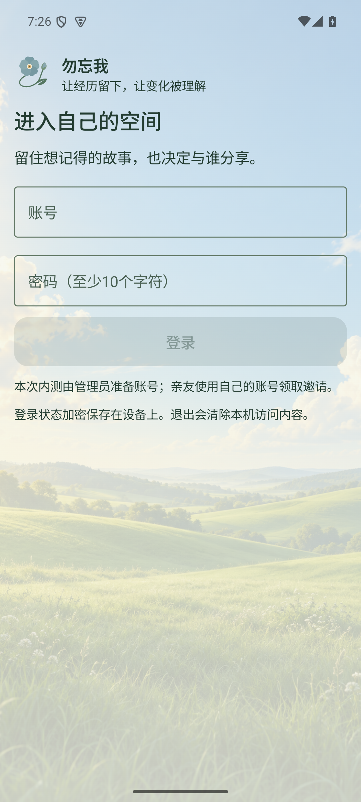

## 02. 原生录音

实际 MediaRecorder 已开始录音；声音来自注入模拟器麦克风的虚构合成素材，不是真人麦克风。

## 03. 暂停录音

暂停状态与计时；随后实际继续录制。

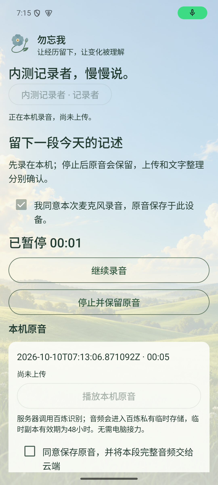

## 04. 本机原音试听

文件先保存在手机应用空间，本机播放位置实际推进。

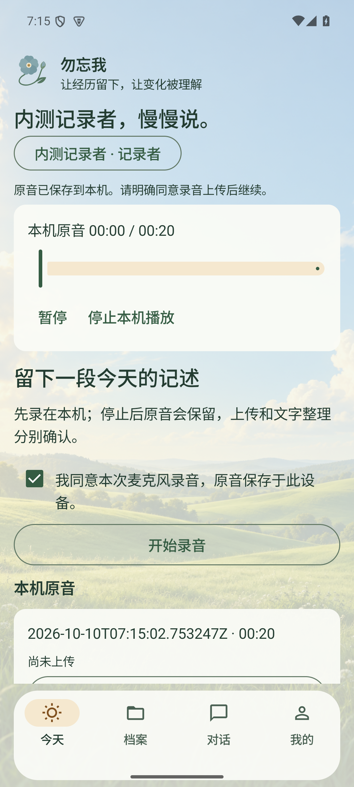

## 05. 机器转写与核对

ECS Paraformer 返回的实际文字。可改识别错误，书面补充另存；此例末句宾语遗漏仍是已知质量问题。

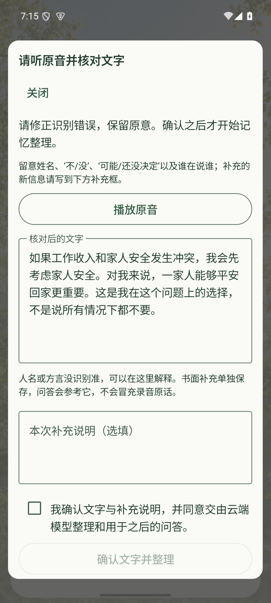

## 06. 故事详情与生成结果

核对后微信 DeepSeek 提取并保存 3 条记忆；原音保存与模型完成是不同阶段。

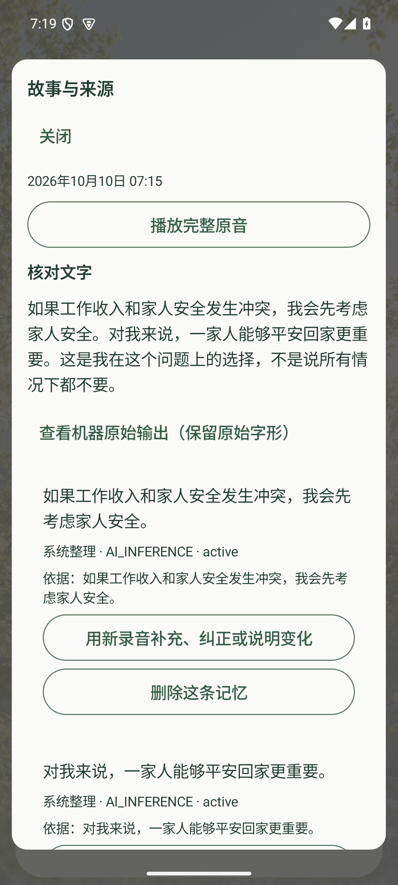

## 07. 服务器原音播放

从 ECS 读取完整来源音频，播放位置实际超过 1 秒；不是静态播放器示意。

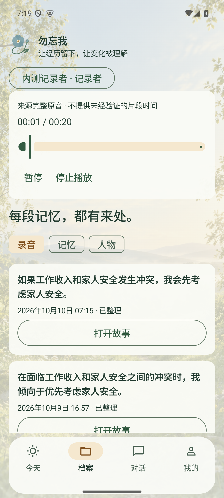

## 08. 有来源的回答

问题经过真实云模型链路，显示 SIMULATION。这次回答引用空间内较早的同主题有效来源，并非只用刚录入的一条。

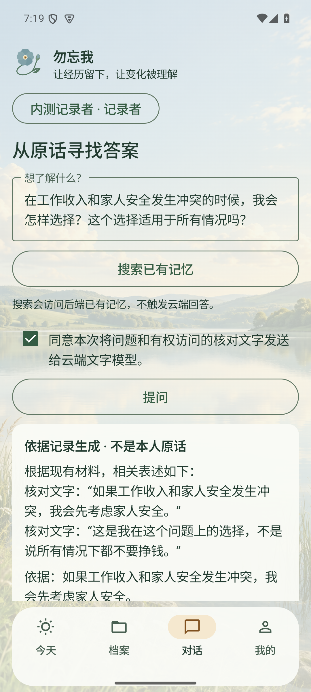

## 09. 打开回答的原音

实际播放该回答所引用的来源原音；没有可靠时间对齐，不伪造句子片段定位。

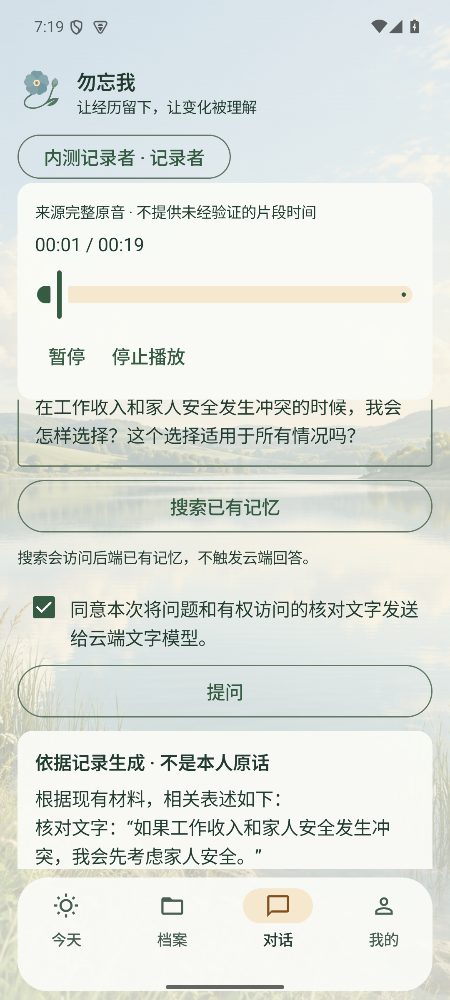

## 10. 八个内容侧面

真实数据计数与筛选入口；不是八份模型人格分数，没有内容的分类不会补造。

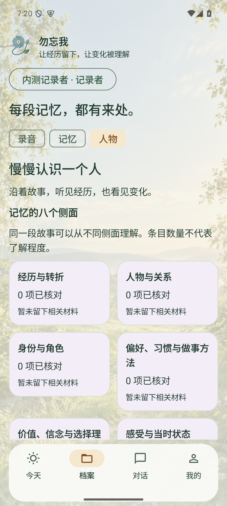

## 11. 四个人物视图

人生足迹、重要的人、在意与选择、声音与表达；短素材不足以形成四份丰富画像。

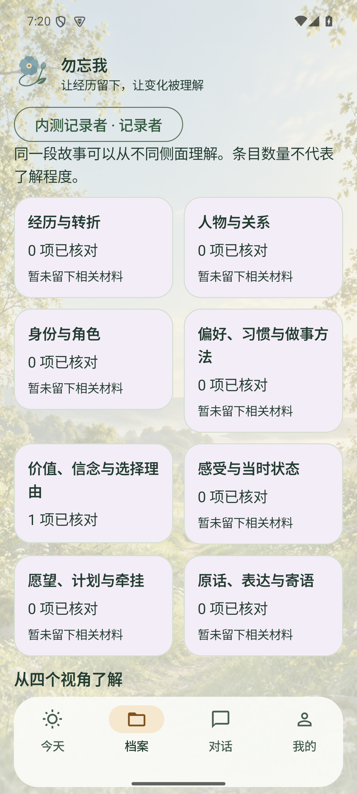

## 12. 理解及其依据

云端任务产生待核对的情境观察，展开证据；候选不是本人已经认可的稳定人格。

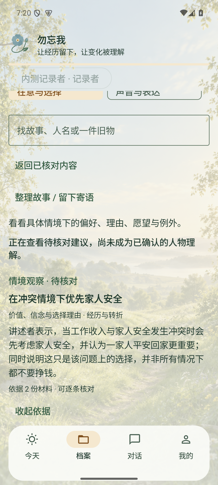

## 13. 分享预览

先说明整段录音和核对文字的分享范围，并单独确认云端问答使用。

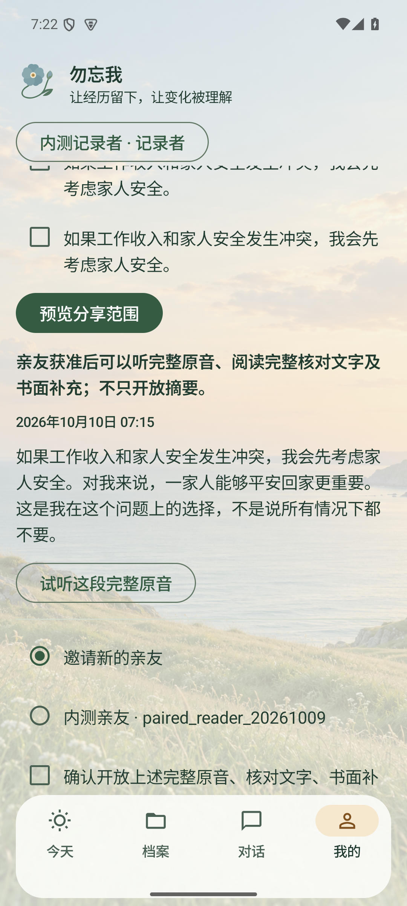

## 14. 本人确认接收账号

亲友先领取邀请；本人核对普通账号并批准后才开放。此截图为确认界面，后续亲友读到内容证明批准执行。

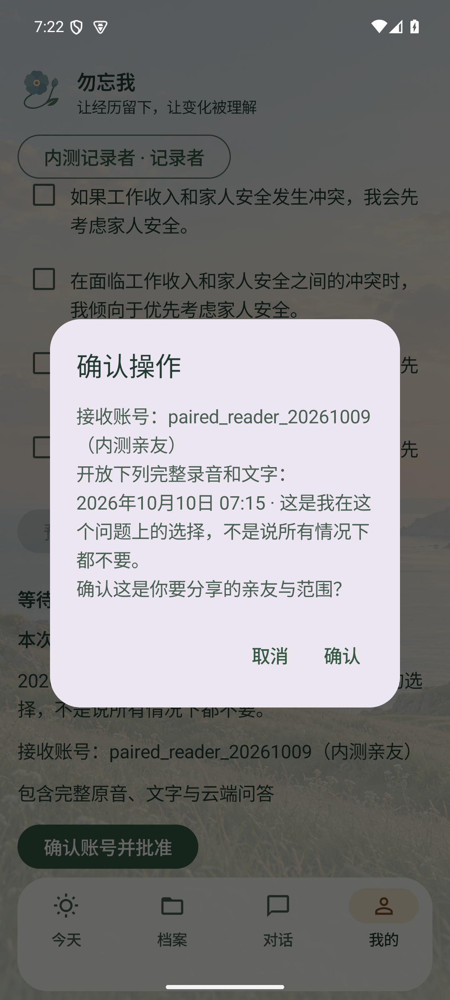

## 15. 亲友看到故事

切换独立普通账号进入获授权空间；两账号本轮在同一模拟器顺序使用。

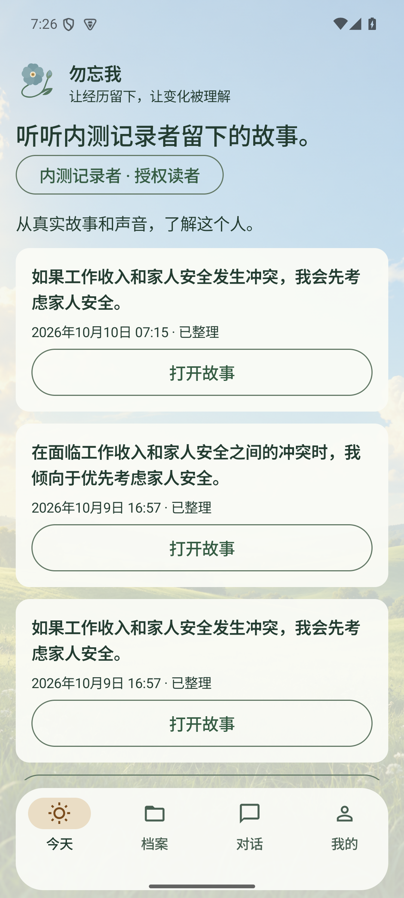

## 16. 亲友播放原音

授权后实际播放来自服务器的声音。

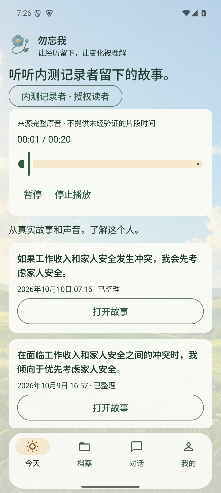

## 17. 诚实的未知回答

问未留存的老师姓名返回 UNKNOWN，没有引用或编造姓名。

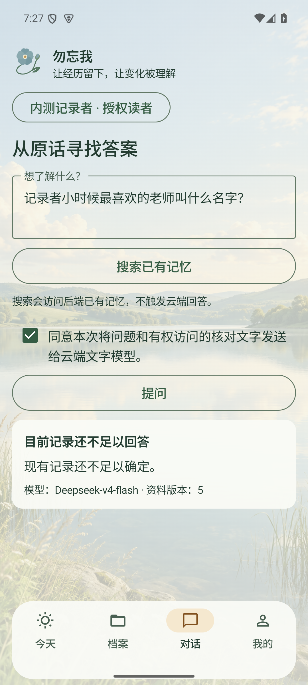

## 18. 亲友提出补充请求

将不知道的问题交回本人，不把问题当成本人经历。

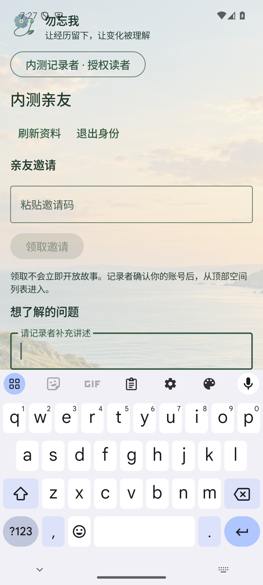

## 19. 本人收到问题

切回本人，能看到问题及处理入口；本次 19 图结束于这里，未包含回答后再分享和撤权的新一轮截图。

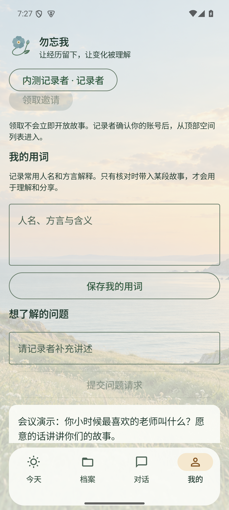
