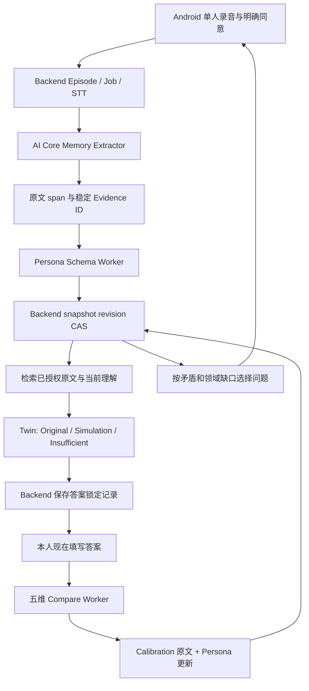

# Agent 核心闭环：开发与联调

当前普通分支为 `feature/ai-agent-core`，在原项目目录 `/home/qingtian/projects/Remember-Me` 从 `feature/android-capture-to-model` 的 `c35ede0` 建立。保留原 Android Capture/HTTP 原型及有用的理解页入口，再迁入旧 Agent 提交的增量；没有另建工作树。旧本地人格推导（按记忆类型与条数累计理解）已移除，模型来自按 Actor / Subject 授权的 Backend 快照。

这是用户在 2026-10-03 授权的最小实验闭环。现有 `integration-contract-v0.1.2` 不变，新增契约见 [Proposal](../proposals/AGENT_CORE_LOOP.md) 与 `packages/contracts/remember_contracts/agent.py`。新路由默认关闭，仍待团队将实验契约审阅为正式版本。Android 保留现有录音原型，无界面重做。

## 核心与责任



- **AI Core**：一个主模型，Memory、Persona、Twin、Compare 分别使用 schema；上下文、支持、反例和时间变化保留。模型只提出变化，代码分配 ID、检查引用、合并状态。不同情境保持独立；同情境的 SUPPORT / CONFLICT / CHANGE 不覆盖源记录。
- **Backend**：Actor + Subject 分区、实验 Cloud Twin consent、材料解析、Job/租约/退避、持久 snapshot revision、乐观锁、先锁后答与幂等提交。Provider 暂时不可用时保留旧快照和锁定记录；撤回期间拒绝继续调用或交付答案。
- **Android**：只访问 Backend，通过 Repository 消费 JSON。Subject 或 credential 改变立即清空缓存，旧请求不能覆盖新会话。ViewModel 保留当前会话跨 Activity 重建；进程重启后重新连接读取服务端模型。

`model_version` 记录推理部署版本，`revision` 记录 Person Model 快照版本。Trait 的 confidence 是内部未校准值，页面不将它显示为忠实度百分比。Planner 为显式领域优先级/矛盾优先的启发式，每次返回一个问题，不宣称测量了信息增益。

转写、历史 Memory 提取结果、当前 Person Model 是不同层。本人明确纠正转写中的事实时，新增 CALIBRATION 证据，由 Persona 修正受影响的旧理解并保留未被更正事实；旧转写和旧快照保留，不把误识别修复描述成本人改变了姓名。`agent-workers-v4` 明确这项规则。

Twin 对相同问题（忽略空格、标点与大小写）优先逐字引用最新有效的本人校准，仍标注 ORIGINAL / CALIBRATION；校准没有回答的其他问题继续走检索和模型判断。反证表示“挑战了某个结论”，不等于不可引用；已撤回、未授权、被替代的材料继续排除。无法解决的矛盾返回矛盾原因，不混同于缺少材料。

已由校准替代的旧结论若与其他事实共用完整转写，查询其他事实时使用私有整合 Schema，只允许 SIMULATION / INSUFFICIENT，防止将含旧错误的整段转写标为当前原话。仍可引用这段材料中未更正的事实；历史查询也保守标注整合，不宣称精确事实分段已经完成。对相同校准问题的逐字路由不受影响。

代码升级后若需修复旧派生快照，可使用本机工具 `scripts/reapply_agent_calibration.py`，默认预览，显式 `--apply` 才追加 revision；记录与原始 Episode 不变。它没有新增 API、契约或数据库 schema。详见 [校准修复验证](../verification/CALIBRATION_CORRECTION_2026_10_06.md)。

## 最快运行一轮

已安装的 Python 环境在各服务的 `.venv`；从项目根目录运行：

```bash
uv sync --project services/backend --locked
uv sync --project services/ai-core --locked
services/backend/.venv/bin/python scripts/run_agent_demo.py
```

脚本运行独立的 Backend、AI Core、raw-body STT HTTP 服务，用实际 Job 完成两个 Episode、中间一次 Twin 锁定与校准。校验锁定摘要、五维结果和 revision 增长。离线音频是静音 WAV，STT 忽略语音，LLM 是 deterministic fixture，**该命令证明接线与持久化，不证明真实转写或人格理解质量**。

不打印 token。结果保存到 `build/agent-demo/fixture/last-loop.json`，日志在同一目录。一次性验证的数据库放在临时目录并自动清理，保存的报告不包含凭据。

## 电脑浏览器调试 Agent

Agent 开发优先使用电脑 Chrome / Edge 和耳机麦克风，避免每次构建 APK 与连接手机：

```bash
services/backend/.venv/bin/python scripts/run_agent_demo.py --serve
```

打开 `http://localhost:8000/debug/agent/`，加载会话，允许并选择麦克风，录音、试听、明确同意后上传。处理走原有 Backend / STT / AI Core，页面显示记忆、快照与原文。问 Twin、先锁定后校准、恢复锁定和下一次问题均复用现有实验 API。浏览器来源使用既有 `IMPORT`，没有新契约或 Android 供应商依赖。

前端修改后刷新；服务端代码或 `.env` 修改后停止并重启 demo。该入口只用于本机开发，Android 仍是产品客户端。详细步骤见 [调试台说明](../../scripts/agent_console/README.md)，浏览器与真实供应商的验证见 [验证记录](../verification/BROWSER_AGENT_2026_10_05.md)。

## Android 壳联调

```bash
services/backend/.venv/bin/python scripts/run_agent_demo.py --serve
```

`--serve` 默认使用 `.env` 中的真实 Provider，持续运行服务与 Worker。数据库、音频和开发会话保存在 `build/agent-demo/configured/`，会话字段在该目录的 `session.json`（文件权限 0600，整个 build 目录被忽略）。重启复用同一 Subject，Ctrl-C 结束服务。

1. 安装 `apps/android/app/build/outputs/apk/debug/app-debug.apk`。
2. USB 调试连接后 `adb reverse tcp:8000 tcp:8000`，Backend 填 `http://127.0.0.1:8000`。模拟器也可用 `http://10.0.2.2:8000`，需要确认模拟器能访问所在主机/WSL 服务。
3. 使用现有录音页面，保存后填写 Backend、Actor Token、Subject ID、RECORDING consent。勾选“同意 Cloud Twin 处理，并声明为本人单人录音”，再上传。
4. Processing ready 后点击“查看 AI 的理解”，进入 Agent 页面。可以刷新模型、填写问题、问 Twin、查看原文与来源。
5. 点击“先锁定，再校准”，等服务端返回 LOCKED 与 calibration ID 后，页面才显示本人答案输入框。提交后显示五维差异和新的 revision。
6. 点击“下一次可以聊什么”，再录一段。会话内上传参数可复用。撤回 Cloud Twin 后不再读取或生成 Agent 结果。

手机端 UI / 录音验收可以改用 [Android 11 及以上的 Wi-Fi 配对调试](https://developer.android.com/studio/run/device#connect-to-your-device-using-wi-fi)，电脑与手机连接同一无线网络，在 Android Studio 中配对设备后无线安装与调试。安装包分发也可使用 [Android 官方支持的网站或私有渠道](https://developer.android.com/distribute/marketing-tools/alternative-distribution)，但包分发与手机访问 Backend 是两项配置；目前这个 demo 仍监听本机回环地址。后续面向团队的安装包更新需维护签名和递增版本，当前工作没有建立发布或自动更新渠道。

需要离线接线测试时，显式运行 `--serve --mode fixture`，使用 `build/agent-demo/fixture/session.json`。Fixture STT 对手机实际录音仍返回固定的测试句，不能作为真实语音验收。两种模式使用独立数据库和凭据；切换到真实模式时，更新 App 的 Actor Token、Subject ID、RECORDING consent，重新上传录音。旧 fixture 的记忆不会自动改成真实结果。

## 切换真实 Provider

AI Core 已有的 `openai_compatible` adapter 同时供三个新增 Worker 使用；真实配置失败时不回退 fixture。将 `services/ai-core/.env.example` 复制到 `.env`，设置：

```dotenv
AI_AGENT_ENABLED=true
AI_PROVIDER=openai_compatible
AI_MODEL=<供应商实际模型名>
AI_MODEL_VERSION=<团队定义的部署版本>
AI_BASE_URL=<支持 chat/completions 与 strict json_schema 的 /v1 地址>
AI_API_KEY=<仅服务端配置>
AI_TIMEOUT_SECONDS=90
```

部分 compatible 供应商不支持严格 JSON Schema；需实际联调验证，不只凭“兼容”命名判断。Persona/Twin 输入为结构化材料和当前快照，Memory 输入保持旧接口。任何供应商钥匙均不进入 Android。

将 Backend 的 `.env.example` 复制到 `.env`，配置真实 STT bridge：

```dotenv
REMEMBER_AGENT_ENABLED=true
REMEMBER_AI_BACKEND=http
REMEMBER_AI_CORE_URL=http://127.0.0.1:8100
REMEMBER_STT_BACKEND=http
REMEMBER_STT_URL=<真实 bridge 地址>
REMEMBER_STT_PATH=/transcribe
```

STT bridge 必须接受 `POST` 的原始音频 bytes 和音频 Content-Type，返回 `{"text":"中文转写","model_version":"实际STT版本"}`。该 raw-body 协议不直接等于任意商业 STT 接口；需要 bridge 完成鉴权和供应商格式转换。Voice 与硬件供应商仍独立。

使用千问 `qwen-audio-3.0-asr-flash` 时，可直接选择 Backend 的 DashScope adapter，无需额外 bridge：

```dotenv
REMEMBER_STT_BACKEND=dashscope
REMEMBER_STT_URL=https://<工作空间>.cn-beijing.maas.aliyuncs.com
REMEMBER_STT_PATH=/api/v1/services/aigc/multimodal-generation/generation
REMEMBER_STT_MODEL=qwen-audio-3.0-asr-flash
REMEMBER_STT_API_KEY=<仅服务端配置>
REMEMBER_STT_TIMEOUT_SECONDS=90
REMEMBER_AI_TIMEOUT_SECONDS=90
REMEMBER_AGENT_TIMEOUT_SECONDS=90
```

该 ASR 使用 [原生 DashScope 接口](https://help.aliyun.com/zh/model-studio/non-realtime-speech-recognition-user-guide)，地址不包含 `/compatible-mode/v1`。它只负责转写；记忆提取与 Agent 仍需文本模型。同一工作空间的文本模型通过 `AI_BASE_URL=https://<工作空间>.cn-beijing.maas.aliyuncs.com/compatible-mode/v1` 调用。本次配置的文本模型是 `qwen3.8-flash`，设置 `AI_ENABLE_THINKING=false`。这个可选参数只在配置时发送，其他兼容供应商可省略。

Memory 提取使用 `memory-extractor-v3`：程序提供原文全文的准确 span，模型复用该原文证据；原文与位置校验仍执行。身份类提问补充检索当前 IDENTITY Trait 的授权证据，最终回答仍由 Twin 判断相关性并引用原文。中文原文直接传入模型，摘要保持输入语言。
若已有 `.env` 显式设置 `AI_PROMPT_VERSION`，同步改为 `memory-extractor-v3`。2026-10-05 的真实录音验证及失败记录见 [千问联调记录](../verification/QWEN_ASR_2026_10_05.md)。

```bash
services/backend/.venv/bin/python scripts/run_agent_demo.py --serve --mode configured
```

配置模式不启动 fixture STT，AI Core 强制使用非 fixture 环境，缺少真实配置会启动失败。真实验收要用现场新录音和未预置的问题。

## 实验 API

前缀 `/experimental/agent/v1/subjects/{subject_id}`，所有请求使用 `Authorization: Bearer <Actor token>`。

| 操作 | 方法和路径 | 行为 |
|---|---|---|
| 明确同意与本人声明 | POST `/grant` | `recording_consent_id`, `cloud_twin_consent:true`, `subject_single_speaker:true` |
| 撤回 Cloud Twin | DELETE `/grant` | 后续读写拒绝；客户端清缓存 |
| 快照恢复/更新 | GET `/model` / POST `/model/refresh` | typed traits、revision、部署版本；更新 CAS |
| 原文材料核对 | GET `/evidence` / `/evidence/{id}` | 按 Actor + Subject + 当前同意解析原文 |
| Twin 问答 | POST `/twin` | question → ORIGINAL / SIMULATION / INSUFFICIENT，包含实际原文证据 |
| 答案锁定 | POST `/calibrations` | 只接受 question；保存 answer、revision、time、digest |
| 锁定恢复 | GET `/calibrations/{id}` | 可重连读取同一锁定记录 |
| 本人校准 | POST `/calibrations/{id}/submit` | human_answer + expected_revision；比较与模型回写同事务；同答案重放幂等 |
| 下次采集建议 | GET `/plan` | 一个问题、理由、目标领域、HEURISTIC 标记 |
| 撤除 Agent 录音材料 | DELETE `/episodes/{id}/use` | 排除该 Episode 的 Agent 使用，失效依赖 Trait 与 Calibration；原 Episode 的存储接口仍独立 |

上述撤除是 Agent 材料使用权，尚未实现原始音频物理删除、导出、生产身份关系或 Legacy 授权。材料来源是 SELF_ATTESTED，不是 speaker verification。明显的转述词有保守 gate，不能当作全面说话人/语义认证。

原型预算：160 条授权材料/160 Trait，每次最多 40 条新材料，Twin 最多检索 12 条。超过预算明确失败，不静默截断。语义正确性、Original 的回答相关性、中文召回和候选 trait 质量仍需真实模型标注评测；逐字与引用校验无法证明语义成立。

## 环境与验证

本次安装 JDK 17 和 Android SDK 35 到 `/tmp/remember-agent-toolchain/`，没有覆盖系统 Java。当前运行方式：

```bash
export JAVA_HOME=/tmp/remember-agent-toolchain/jdk-17.0.20.1+1
export ANDROID_HOME=/tmp/remember-agent-toolchain/android-sdk
export GRADLE_USER_HOME=/tmp/remember-agent-toolchain/gradle
export PATH="$JAVA_HOME/bin:$PATH"
cd apps/android
./gradlew --no-daemon test assembleDebug assembleDebugAndroidTest
```

Python 与 Contract：

```bash
cd services/backend && .venv/bin/python -m pytest tests
cd services/ai-core && .venv/bin/python -m pytest tests
cd packages/contracts && npm test
```

修改 shared Python schema 后用根目录 `services/backend/.venv/bin/python scripts/export_agent_schema.py` 重新导出 JSON。部署必须同时包含 `remember-me-contracts` 包；`uv sync` 已通过 workspace path dependency 安装。若使用 wheel 部署，先构建 contracts wheel，再与 AI wheel 一起安装，不能只安装 AI wheel 后期待 PyPI 存在尚未发布的实验包。

实际验证与已知验收边界见 [verification record](../verification/AGENT_LOOP_2026_10_03.md)。
