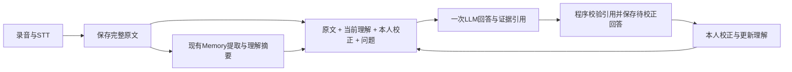

# Agent loop review and minimal question-answer path — 2026-10-06

This review follows the user's request to stop adding case-specific routing patches,
retain the Memory implementation, and avoid compression or a new memory framework.

## Existing path and findings

1. Backend STT stores the entire recognized text in `Episode.transcript` before
   Memory extraction. The current real team recording contains four members and
   economics, electronic information and transportation majors. The original is
   present; this is not a missing-recording failure.
2. Memory extraction produces summaries and evidence spans. The experimental
   resolver sends those authorized spans to Persona; Persona proposes incremental
   traits, which Backend validates and persists by revision. A summary may omit
   facts, so question answering must also retain access to original text.
3. Twin selects at most twelve spans with Chinese character bigram overlap and
   special identity phrases. Different wording can remove useful materials before
   the model sees them. Trait conflicts and supersession can block unrelated facts
   that share one recording. This is not semantic retrieval.
4. The model chooses ORIGINAL/SIMULATION/INSUFFICIENT. ORIGINAL must exactly equal
   one entire excerpt. A helpful shorter answer marked ORIGINAL is rejected;
   copying the full recording passes despite poor question-answer presentation.
   Prior fixes added question-specific correction routing and a second schema,
   increasing branching without establishing general factual QA acceptance.
5. In five direct HTTP reproductions of the real team question, AI Core returned
   502 EVIDENCE_INVALID. Backend maps every 5xx to AI_UNAVAILABLE/503, hiding the
   validation failure. Separate real-provider runs sometimes passed by copying the
   complete excerpt, confirming inconsistent routing/format behavior.
6. Existing automated tests largely establish persistence, authorization and
   fixture wiring. A few real name/school checks do not establish general factual
   answer quality. No claim of a stable complete real-model loop follows from them.

## Replacement scope

- Keep Episode/audio/transcript storage, Memory extraction, Persona summary/update,
  revisions, consent/subject isolation, immutable calibration and provider adapters.
- Replace Twin's lexical retrieval, identity phrase list, global conflict gate and
  mixed-excerpt schema with one full authorized-context question-answer worker.
- Worker input includes original material, current active understanding and all
  authorized corrections. Summaries supplement originals; they do not replace them.
- LLM returns `answerable`, concise `answer`, cited `evidence_ids` and `limitations`. Code assigns
  ORIGINAL only to an exact cited excerpt, SIMULATION to an evidenced generated
  answer and INSUFFICIENT when the requested fact is absent. Background citations are not presented as supporting an unknown fact. No model-owned
  routing enum can reject an otherwise correctly cited answer.
- A correction is supplied with its question and time. Latest relevant correction
  supersedes an earlier mistaken fact, without making every old recording unusable.
  Conflicts must be assessed against the question rather than blocking a recording.
- Preserve real provider/schema/provenance failures; distinguish invalid output
  from unavailable services. Do not mask errors with fixture or uncited fallback.
- Use deterministic sampling for QA only. Repeated factual consistency is a test
  requirement; wording need not be byte-identical.
- No compression, embeddings, new Memory framework, shared contract/schema changes
  or hard-coded team facts. Oversized contexts must fail explicitly, not truncate.

Acceptance covers repeated team count/major questions, paraphrases without literal
word overlap, identity correction, unknown facts, irrelevant conflicts, bad references,
withdrawal/isolation, unchanged Memory output and the browser correction loop. Actual
results belong in a verification record, not in an untested completion claim.
