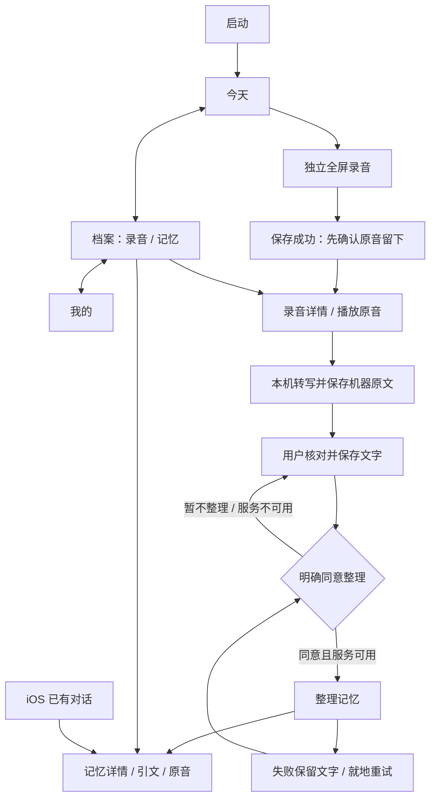

# 勿忘我 · 页面与组件规格

## 双端导航



Android 首批固定导航为“今天 / 档案 / 我的”；对话有真实能力后加入第三位。iOS 为“今天 / 档案 / 对话 / 我的”。Android 用 Material 3 NavigationBar，iOS 用原生 TabView，各页面滚动与搜索状态独立保留。

## 页面清单

| 页面 | 首要信息 | 主要动作 | 空 / 失败 / 大字处理 |
|---|---|---|---|
| 今天 | 日期、问候、一个录音主入口、未完成记录、最近三条真实录音 | 开始录音、继续处理 | 空档案说明第一步；主入口随正文可滚动 |
| 录音 | 真实计时、电平、正在录音 / 已暂停 | 暂停 / 继续、完成并保存 | 操作区固定底部；正文滚动；权限失败可去设置 |
| 已保存 | 原音保存确认、播放器 | 查看文字、再录一段 | AI 不参与保存成功判定；再次录音生成新文件 |
| 档案 | 日期分组、录音 / 记忆分段、本地搜索 | 打开录音或记忆 | 无结果就地说明；不混入测试故事 |
| 核对 | 真实播放器、处理状态、可编辑转写 | 保存文字、确认并整理 | 固定操作区避让键盘；服务不可用时保留本地保存 |
| 记忆详情 | 内容、来源类型、原文证据、原音 | 播放、删除 | 无引文明确标注；删除后原音不受影响 |
| 我的 | 数据使用、系统授权、系统外观、连接情况 | 打开系统权限 | 不展示供应商选项、密钥、采样率等调试控件 |

标题不依赖云端自动命名。转写前不会偷偷发送标题请求。未来可以单独增加本地手动重命名，不与内容生成绑定。

## 视觉规范

当前为第四轮：雾蓝 / 灰紫 / 暖沙静态渐变，内容蒙版与按压反馈。第三轮字体、列表和花形位置保留。当前材质规范见 [VISUAL_V4.md](VISUAL_V4.md)，组件参考仍见 [VISUAL_V3.md](VISUAL_V3.md)。


颜色、字号和尺寸机器可读版本见 [tokens.json](tokens.json)。

| 语义 | 浅色 | 深色 |
|---|---|---|
| 页面背景 | `#E4E9F2` | `#171F30` |
| 内容面 | `#EDF0F6` | `#232D40` |
| 正文 | `#20242C` | `#F0F1F4` |
| 辅助文字 | `#536176` | `#ADB3BF` |
| 主操作 | `#325CCB` | `#A9C0FF` |
| 主操作文字 | `#FFFFFF` | `#152B59` |
| 柔和强调面 | `#DEE6F4` | `#28354B` |

页面标题 26 / 中等字重、分区 18 / 中等字重、正文 / 主按钮 17、辅助文字 14；Android 使用 sp，iOS 使用系统 Dynamic Type 样式映射。录音计时单独使用等宽数字，避免跳动。无外部字体包。

间距用 4 / 8 / 12 / 16 / 24 / 32；左右 20，窄屏 16。Android / 原型控件圆角 14，播放器容器 16；iOS 分组容器 14。列表依靠留白与分隔组织；转写和来源内容使用稳定实色。

22 个指定文字 / 背景组合通过 4.5:1 检查，最低 4.57:1（含新增渐变采样）。这不是对所有原生组件、透明叠层和系统无障碍模式的全面认证；实机验收继续检查实际合成色。

## 组件与反馈

| 组件 | 约束 |
|---|---|
| 主按钮 | 高度至少 56，文字允许换行；Android 系统 ripple，iOS 按压约 100 ms |
| 图标 | Material / SF Symbols；可访问名称由按钮文字或说明提供 |
| 列表条目 | 标题、日期、时长、文字状态；整个条目可点 |
| 播放器 | 准备中、播放 / 暂停、当前位置、真实总时长、定位；同时一个播放器 |
| 音量显示 | Android 来自 MediaRecorder.maxAmplitude，iOS 来自录音电平；暂停后停止更新 |
| 来源块 | 本人叙述 / 他人提供 / AI 推测 / 来源待核对；不只靠颜色 |
| 状态提示 | 保存成功与错误持久显示；错误可重试，不依赖短暂 toast |
| 完成触觉 | Android 在文件与 sidecar 保存后才确认；录音开始不触发可能进入原音的触觉 |
| 减少动态 | Android 原生控件遵循系统动画设置；iOS 禁用自定义按压缩放 / 波形插值；所有状态保留文字 |

Android 的正文和导航用 Material 表面层级，不绘制玻璃模糊。iOS 使用系统导航材质，不自制 Liquid Glass；新系统效果取决于 SDK、系统与用户无障碍设置。旧系统保留标准系统外观。当前实现没有自定义透明长文背景。

第三轮首页以 32 点简化花形搭配产品名，使用至少 56 高的单一录音按钮。列表取消图标底块，以分隔线和留白区分。录音电平区域高度 130；圆形播放按钮 48。空状态使用 80 点材质花形；标识不承担电平或处理进度含义。深色采用对应标识配色，200% 文字允许换行与滚动。

## 处理状态与数据语义

```text
未处理 → 转写中 → 待核对 → 整理中 → 完成
              ↘ 失败       ↘ 失败
```

“失败”不清空已完成阶段。是否已有转写 / 是否确认由持久字段判定；重试整理不会重做转写。`transcript` 永远是机器原文，`reviewedTranscript` / `reviewedAt` 是独立核对版本。修改核对文本后旧派生记忆标为 `superseded`，历史保留。

重新启动时，遗留的 `Transcribing` / `Organizing` 变为“处理已中断，可重试”；不自动重新联网。旧 sidecar 缺少核对字段时，不补造确认时间。

保存使用原子 sidecar 写入。原音与 sidecar 分开存储；若 sidecar 损坏或写入失败，可读取的原音显示为恢复录音，不删除。损坏到无法解析的音频仍保留在磁盘，但不能伪装为可播放记录。

整理结果保留来源录音、引文、来源类型。返回的非空引文必须出现在确认文字里。重复成功调用不生成第二套当前记忆；失败重试替换当前结果并保留历史。

## 后续功能规格（本批不新增实现）

| 能力 | 页面结构 | 进入实施的前提 |
|---|---|---|
| 对话 | 提问输入 → 回答 → 区分原话与推测 → 展开证据 → 播放来源 | 真实服务、授权及无证据回复语义明确；Android 不占假入口 |
| 校准 | 原回答 / 我的真实回答 → 差异 → 用户确认纠正 | 来源修订、模型版本及下游失效机制到位；iOS 现有能力保留 |
| 个人声音 | 独立授权说明 → 样本录制 → 使用范围 → 撤销 | 不复用一般录音授权；需要独立撤销和删除样本能力 |
| 托付 | 指定接收人 → 指定内容 → 授权条件 → 二次确认 | 有可执行的权限、撤回和交付规则后再开放；不制作可点击假流程 |

这些页面继续使用来源块、状态提示、原音播放器与相同文字层级，避免重新引入卡片堆叠和工程参数。

## 依据

本轮按已批准方案采用 [Apple Liquid Glass 指南](https://developer.apple.com/documentation/technologyoverviews/adopting-liquid-glass)、[Android 无障碍指南](https://developer.android.com/design/ui/mobile/guides/foundations/accessibility) 和 [WCAG 文字对比度说明](https://www.w3.org/WAI/WCAG22/Understanding/contrast-minimum.html)。100 ms / 200–300 ms 是项目调校起点，并非平台硬性时长。
