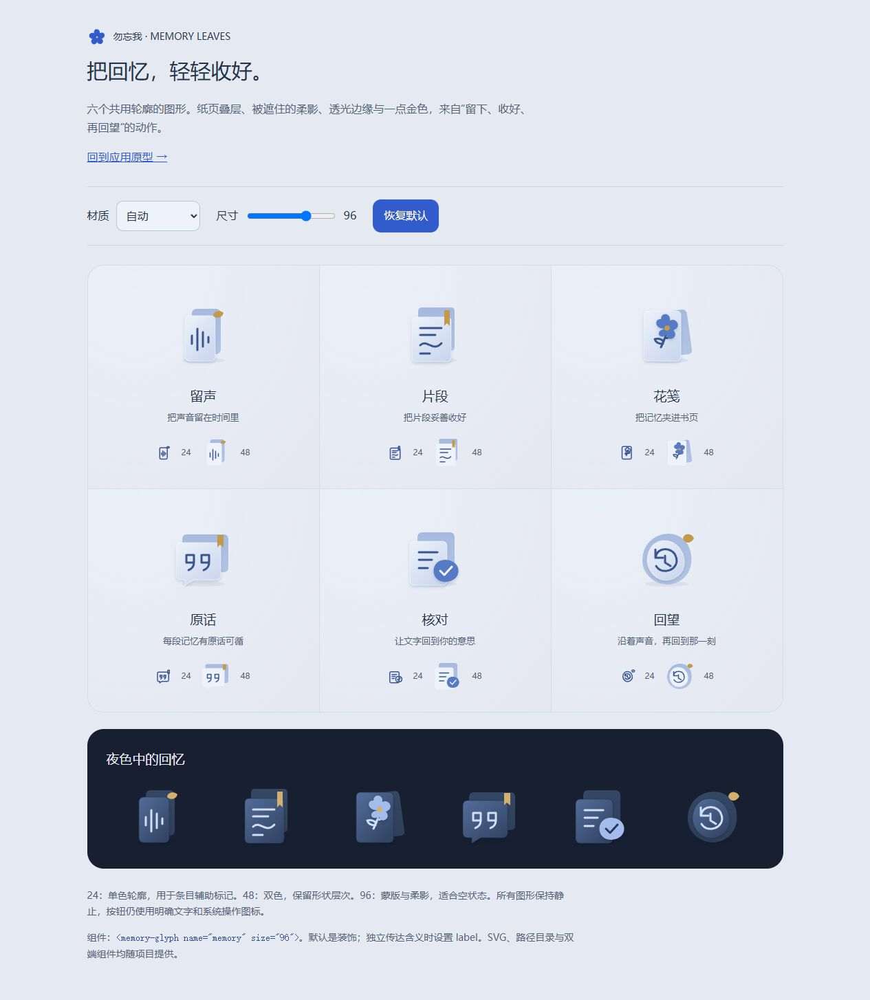

# 勿忘我移动 UI · 2026-09-27 交接

> 2026-10-02 v22 补充：[风景里的薄玻璃](GLASS_MATERIAL_V22.md) 为当前网页材质。公共染色/模糊变量统一花瓣标签、操作栏、导航、首页与个人页卡片；小标签数量改为徽标并保留可访问名称。7/7 相关回归通过，窄屏、日夜景与实色回退已检查。原生端未在本轮修改。

> 2026-10-02 v21 补充：[走进整座花园](MEMORY_GARDEN_V21.md) 为当前网页。移除内层画框裁切，背景与花枝/标签共用平移缩放；默认四景轮换，层级浏览保持同景；枝干使用透明写实纹理并校准两端。31/31 检查通过，390 / 358px、夜间阅读、快速返回与大字号/减少动态已检查。原生和真人录音链路状态不变。

> 2026-10-02 v20 补充：[薄暮里的记忆花园](MEMORY_GARDEN_V20.md) 为当前网页。以两张侧视花朵形成视觉纵深，统一标签/焦点/花梗的图像坐标；三种背景在预览设置切换，远景微光独立可暂停。27/27 检查通过，转场与窄屏已核验。原生仍以既有版本为准。

> 2026-10-02 v14 补充：[一簇可以生长的记忆](NATURE_UI_V14.md) 为最新网页视觉。9 朵 / 45 片不同花瓣，更大的花园区域、有界分枝浏览；首页透明卡片在默认首屏完整露出四角。13/13 自动检查及浏览器增量验收通过，原生与真实录音链路边界不变。

> 2026-10-02 v13 补充：[流云与花枝](NATURE_UI_V13.md) 为最新网页视觉。首页支持独立云层位移/暂停/减少动态，花图改为品牌曲线花瓣与点绘肌理，可切换星丛。新增素材与提示词在 nature/cloud-asset-v13.json；12/12 检查通过，原生和共享协议未改。

> 2026-10-02 v12 补充：[意象选择与场景深化](MEMORY_GARDEN_V12.md) 已在网页实现，新增本地 per-point 采用/隐藏、原话变更复核和图片就绪检查；花图改为稳定不等距点位与同源故事连线。12/12 自动检查及浏览器增量验收通过。仍使用三张预生成图，未接实时模型或原生新界面。

> 2026-10-02 v11 补充：网页主线更新为 [记忆花园](MEMORY_GARDEN_V11.md)，已实现点选浮窗、缩放/平移、场景页与真实合成示例音频。新增三张 1536×1024 记忆意象并保存提示词、哈希与原稿来源。原生代码和共享 Contract 未随本轮变化；旧段落中的“原型播放器全为模拟”不适用于新花园播放器。

> 2026-10-02 更新：当前视觉以 [清晰层级与流畅导航 v9](NATURE_UI_V9.md)、tokens.json 和本地代码为准。下文 v6 截图、构建与分支信息是 09-27 的历史记录；不代表本次验证。

本次交付为第六版 UI 设计原型、Android 实现、iOS 对齐代码、品牌源资产和可复用回忆图形。用户已确认当前视觉方向可交接；这不代表原生真机验收或正式发布完成。两条工作线分别同步到原私有仓库 `ztjklt/Remember-Me`，以 Draft PR 保留供接手。

GitHub 交接入口：**[Android / 设计资产 PR #79](https://github.com/ztjklt/Remember-Me/pull/79)**、**[iOS 对齐 PR #80](https://github.com/ztjklt/Remember-Me/pull/80)**。两者均为 Draft，未合并。远端检查由创建 PR 自动触发，实时结果以各自 Checks 为准；#80 中出现的 Android CI 不等于 iOS Xcode 编译。

## 1. 接手先看这里

1. 先阅读本页的分支依赖和能力限制，再打开 [当前原型](prototype.html) 与 [图形组件库](memory-elements/preview.html)。网页需要本地 HTTP 服务，GitHub 文件页不会直接运行原型。
2. 视觉以 **v8 原型 + tokens.json + 多场景自然背景说明** 为准。回忆图形组件继续使用；v2–v6 是历史过程。
3. Android 与 iOS 必须分别拉取、审阅和验证，不要整体互相合并。两条分支携带不同的上游业务代码。
4. 后续先完成 Android 真机录音/播放检查及 iOS Xcode 构建，再接真实整理适配器；不要从原型的模拟成功状态推导服务已经可用。

交付入口：

| 内容 | 位置 |
|---|---|
| 总规格、页面/导航图 | [DESIGN.md](DESIGN.md) |
| 最终颜色、字号、间距与触控尺度 | [tokens.json](tokens.json) |
| 当前可点击流程 | [prototype.html](prototype.html) |
| 背景、蒙版、按钮反馈 | [VISUAL_V4.md](VISUAL_V4.md) |
| 首页、录音条目、播放器层级 | [VISUAL_V5.md](VISUAL_V5.md) |
| 六款回忆图形、跨端 API、参考来源 | [memory-elements/README.md](memory-elements/README.md) |
| Logo 原始资产及接入说明 | [品牌交接](../../assets/brand/forget-me-not/README.md) |
| 验证历史与设备执行单 | [VALIDATION.md](VALIDATION.md) |
| 本次交接复核摘要 | [handoff-verification.json](handoff-verification.json) |
| iOS 对齐说明 | [iOS 分支 UI_ALIGNMENT.md](https://github.com/ztjklt/Remember-Me/blob/codex/ios-ui-alignment/apps/ios/UI_ALIGNMENT.md) |



[首页原型截图](media/prototype-home-v6.png)保留当时的窄窗口预览；完整页面与滚动交互请用本地原型查看。两张图均不是原生 App 或真机截图。

## 2. 分支、固定基线与上游差异

| 工作线 | 交付分支 | 固定实现基线 | Draft PR 的比较基线 |
|---|---|---|---|
| Android + 设计/品牌源资产 | `codex/mobile-ui-core` | #78 的 `f63f7efbe1f9b1cb438e80d230a29861c4b5c04c` | `codex/ui-baseline-pr78-f63f7ef`（同一固定提交） |
| iOS | `codex/ios-ui-alignment` | #77 的 `e146ac56f080299676fed40653394b97a37bd270` | `feature/ios-calibration` |

Android 的基线分支只用于显示本次 UI 差异，**不是新的产品集成分支**。合并 UI Draft PR 到该参考分支不会进入 main/develop；本次不会执行任何合并。iOS PR 则叠在仍未合并的 #77 上。

交接时远端核实：#78 仍 OPEN，已从本次固定基线新增 5 个提交，最新为 `6847e46e60eaeae662275029e30ac7c5857373a2`；#77 仍 OPEN / Draft，head 与本次 iOS 基线一致。状态可能继续变化，接手时重新 `git fetch`。

#78 的新增内容涉及 `feature/MainScreens.kt` 的人物画像/关系图首页，以及 `navigation/RememberMeApp.kt`、`navigation/Routes.kt` 的启动入口。本次 UI 使用 `feature/MobileScreens.kt` 和“今天 / 档案 / 我的”。**待 Android 主线负责人决定画像入口放在哪里，再整合启动导航；不要用整文件覆盖或直接丢弃对方提交解决冲突。** 本交付不包含这 5 个新增提交，也不表示接受 #78 的客户端直连模型路线。

Android 基线继承的根 README、AGENTS 和团队文档中仍有旧 Android-only 文案及旧职责划分。双端方向和当前交付方式以用户明确要求及 [2026-09-26 团队修订](https://github.com/ztjklt/Remember-Me/blob/feature/ios-calibration/docs/team/00_TEAM_OWNERSHIP.md) 为背景；本次只补交接入口，不进行整个仓库的治理文档迁移。建议由 Android 负责人接手 Android 整合、iOS 负责人接手 Xcode 验证；这里不新增指派或通知。

## 3. 今天交付了什么

### 当前设计

- 系统字体、26/18/17/14 字级，统一间距与触控尺寸；Android 最小 48dp、iOS 最小 44pt，主按钮至少 56。
- 雾蓝、灰紫、暖沙的静态渐变及向正文区收敛的蒙版；长文使用稳定表面。浅色背景 `#E4E9F2`，深色背景 `#171F30`，主色浅/深分别 `#325CCB` / `#A9C0FF`。完整值以 tokens.json 为准。
- 减少重复方块卡片；首页保留一个主录音入口，待处理任务用整行操作，近期记录和档案共用条目；播放器区分状态、控制和时间。
- 按下有即时底色/高光/阴影反馈；减少动态时取消自定义缩放，不依赖装饰来表达状态。iOS 减少透明度/增强对比度时回退有色实底。
- 用户选定的 C / 留声五瓣蓝花作为品牌；新增留声、片段、花笺、原话、核对、回望六款原创辅助图形。小尺寸单色、中尺寸双色、大尺寸纸页叠层与柔影。

### Android 行为与代码入口

以 `apps/android/app/src/main/java/me/remember/app/` 为前缀：

| 文件 | 接手内容 |
|---|---|
| `MainActivity.kt` / `navigation/RememberMeApp.kt` | 正常启动和界面入口；与 #78 新导航需要协调 |
| `feature/MobileScreens.kt` | 今天、档案、我的、独立录音、播放器、核对、来源详情 |
| `feature/MobileViewModel.kt` | 可观察状态、操作协调、避免同一录音重复处理 |
| `data/repository/RecordingWorkflow.kt` | 本地转写 → 保存机器原文 → 用户核对 → 明确授权整理 |
| `data/repository/RecordingMetadata.kt` | 旧 sidecar 读取、核对字段、阶段和中断恢复 |
| `data/repository/AndroidAudioCaptureService.kt` | 真实音量/计时、暂停/继续、文件保存、播放/定位、订阅更新 |
| `core/designsystem/Theme.kt` / `Atmosphere.kt` | 颜色、字级、页面背景与蒙版 |
| `core/designsystem/RememberMeBrand.kt` / `MemoryGlyph.kt` | 品牌与六款图形原生适配 |

正常入口不再呈现硬编码故事或假按钮。保存原音后立即确认，不等待 AI；开始录音前停止播放，后台结束并保存主录音；机器转写与核对文字分别保留，删除记忆不删除原音。处理阶段为未处理、转写中、待核对、整理中、完成、失败；中断可重试，不自动上传。

**当前能力边界：** APK 不包含 `paraformer/model.int8.onnx` 权重；无模型时可以保存和播放原音，本机转写显示不可用。`ReviewedMemoryProcessor` 默认未注入，真实远端整理未接通，成功/失败/重试由测试适配器验证。已有旧供应商适配器文件未删除，正常入口不实例化，也不把供应商密钥编入 BuildConfig。

### iOS 行为与代码入口

`apps/ios/RememberMe/Views.swift`、`AppModel.swift`、`RememberMeApp.swift` 及 `Assets.xcassets`：原生 TabView、独立录音、真实播放器与定位、背景保存、按 Episode 保存核对草稿、来源与删除反馈、系统字级和浅深色资源。Twin、校准、记忆纠正与独立声音授权保持原有入口和语义。

iOS **仍通过配对 Mac 转写**，不是 iPhone 本机 ASR；仍保留原有单个待处理录音机制和远端档案依赖。没有引入离线同步引擎或新的后台录音服务。原生系统材质由 SwiftUI 提供，未新增依赖新系统的 Glass API。图形和品牌组件已嵌在 Views.swift；不要再把独立同名 Swift 文件直接加入目标造成重定义。

## 4. 获取、预览、构建

从一个空的工作目录分别克隆，两个目录并排放置：

```sh
git clone --branch codex/mobile-ui-core https://github.com/ztjklt/Remember-Me.git remember-me-ui
git clone --branch codex/ios-ui-alignment https://github.com/ztjklt/Remember-Me.git remember-me-ios-ui
```

已克隆者先保留自己的未提交工作，再 fetch 并切换相应分支；不要使用强制重置。

在 `remember-me-ui` 根目录运行：

```sh
python -m http.server 8768 --bind 127.0.0.1
```

- 应用原型：`http://127.0.0.1:8768/docs/mobile-ui/prototype.html?v=6`
- 图形库：`http://127.0.0.1:8768/docs/mobile-ui/memory-elements/preview.html`
- 品牌源包：`http://127.0.0.1:8768/assets/brand/forget-me-not/v1/preview.html`

原型是明确标记的固定示例，不访问麦克风、不上传资料。请通过 HTTP 打开，因为组件使用 ES module；`file://` 不能可靠载入。无需 npm 安装和远程图片。该 localhost 地址只对启动服务的电脑有效。

Android：JDK 17、Android SDK 35，配置自己的 JAVA_HOME / ANDROID_HOME 或未跟踪的 local.properties：

```powershell
cd apps/android
.\gradlew.bat testDebugUnitTest assembleDebug assembleDebugAndroidTest lintDebug --console=plain
```

macOS/Linux 对应使用 `./gradlew`。APK 在 `app/build/outputs/apk/debug/app-debug.apk`；未作为源码提交或发布正式安装包。模型权重、密钥、签名、local.properties、工具链、临时日志均未上传。

iOS 在 Mac 使用项目支持的 Xcode / Swift 6 工具链（项目部署目标 iOS 17.0），进入 `remember-me-ios-ui/apps/ios`：

```sh
xcodebuild -project RememberMe.xcodeproj -scheme RememberMe \
  -destination 'generic/platform=iOS Simulator' CODE_SIGNING_ALLOWED=NO build
```

再按该分支 `apps/ios/README.md` 配置配对服务、权限与设备运行。**此命令尚未在本次 Windows 环境执行。**

## 5. 组件维护与源资产

品牌源包 `assets/brand/forget-me-not/v1/` 原样保留来源、概念参考、SVG、PNG、适配器、校验清单和生成脚本；其 README 中“尚未接入”是资产初始交付时的历史状态，以父目录交接说明为准。zip 是同一目录的便携副本，保留在本地且不重复提交。

回忆图形的轮廓源是 `docs/mobile-ui/memory-elements/build.py`。在 Android 仓库根目录重生成：

```sh
python docs/mobile-ui/memory-elements/build.py
python docs/mobile-ui/memory-elements/build_native.py --ios-root ../remember-me-ios-ui
python docs/mobile-ui/verify-design.py --ios-root ../remember-me-ios-ui
```

生成器会同时改 Android 的 MemoryGlyph.kt、共享 Swift 源、iOS Views.swift 的生成区；生成后分别检查两边 diff 并提交。不要只改导出 SVG。Web 用 `<memory-glyph name="memory" size="88"></memory-glyph>`，Compose 用 `MemoryGlyph(MemoryGlyphKind.Memory, size = 88.dp)`，SwiftUI 用 `MemoryGlyph(kind: .memory, size: 88)`。默认装饰对读屏隐藏，功能控件由父按钮提供动作名。

SVG 使用真实蒙版/滤镜，Compose 用有限偏移绘制近似柔影，SwiftUI 用 Canvas 阴影；三者不保证像素一致。开源项目仅作设计参考，未复制其图形路径或源码；具体参考及取舍保留在组件 README 与 VISUAL 文档。

## 6. 验证证据与待办

交接时再次执行 Android 四任务成功（大部分为 up-to-date）；现有测试报告 18 项通过、0 失败，lint 0 error / 26 warning。26 项包含依赖版本提示、既有 SDK 检查和一个保留但未使用的旧品牌 PNG。检查摘要记录代码提交、产物哈希、报告数量与执行边界。

| 已完成 | 证明范围 / 限制 |
|---|---|
| Android 编译、单元测试、测试 APK 构建、lint | 流程/来源/兼容测试与编译；未执行设备 instrumentation |
| 22 个文字色组合 + 1676 个渐变采样，最低 4.57:1 | 令牌计算；不替代系统合成材质的像素检查 |
| v6 图形库 24 实例与 36 SVG；12 组首页/档案/核对布局 | 360/412 实际 CSS 宽度，普通浅色/200% 深色；不代表原生手机验证 |
| v5 的 24 组布局、播放器键盘定位/重播/焦点；v3 的 48 组全流程 | 保留为对应轮次的历史证据，未冒充 v6 全量重跑 |
| iOS 四个 Swift 文件语法解析、七组浅深色资产比对 | 不证明 SwiftUI 类型检查、Xcode 构建、模拟器或 iPhone 运行 |

接手执行单（未完成项保持未勾选）：

- [ ] Android 与 #78 最新画像导航决定整合方式，确认实际集成基线后在单独集成分支处理；不强制改写今天的交付历史。
- [ ] Android 真机覆盖权限拒绝/恢复、录音暂停/继续、后台保存、离线回听、拖动定位、旧数据和中断恢复。
- [ ] 决定合规且兼容的本机模型获取方式；按现有 Contract 接入整理适配器，明确资料去向，再验证真实录音至记忆闭环。
- [ ] iOS 首先 Xcode 编译，然后验证配对 Mac、录音/播放、核对、纠正/删除、Twin/校准/声音授权的已有流程。
- [ ] 小屏与大字、浅深色、减少动态/透明度、TalkBack/VoiceOver；原生图形阴影与启动图标实际效果。
- [ ] 代表性中端 Android 性能观察和 5 位目标用户的三任务观察；尚未开展，不声明“已达商业软件水准”。

完整操作与观察记录格式见 VALIDATION.md。浏览器自动指针曾有坐标偏移，键盘检查不能算真机触点验收通过。

## 7. 数据、授权、回退

本次没有修改 `packages/contracts`、共享 Backend、AI Core、Voice 服务、供应商 SDK、远端数据库或部署配置。两条 UI 分支各自与其固定基线比较得出这个结论，不能用它推导两条基线之间没有架构差异。

Android sidecar 增加 `reviewedTranscript`、`reviewedAt`、`processingStage`、`processingError`，记忆保留来源类型与状态；旧 `transcript` 仍为机器原文，读取旧数据不会自动标为已确认。核对文字变更使旧结果转为 superseded 历史。录音目录从系统云备份和设备迁移中排除。iOS 增加以 Episode 为键的本地核对草稿，沿用原服务授权，录音授权不替代声音克隆授权。

尚未集成时回退只需停止采用这两条 UI 分支，主线未被更改。试装后的数据回退不要卸载或清除应用数据；先保留原音与 sidecar/草稿，再在副本上检查兼容性。旧版本可能忽略甚至重写新字段，**未验证无损降级**，不要把可读取旧数据等同于可以安全回写旧版本。后续若集成进主线，应在单独分支针对相关提交撤销/修复并验证数据，不执行强制推送。

本次交接保留本地工作目录及预览服务，未合并上游 PR、未修改 main/develop、未发布安装包或公开站点。
