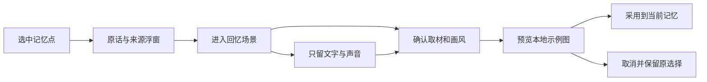

# 记忆花园 v12 · 让意象留在某一刻

2026-10-02。本轮沿着 v11 的“光点 → 原话浮窗 → 回忆场景”继续深化，仍为本地网页原型。Android/iOS、Backend Contract 和真实模型接口未修改。

打开 [手机演示](prototype.html?demo=1#archive) 或 [大屏布局](prototype.html?wide=1#archive)。本地服务仍为 `http://127.0.0.1:8771`。完整素材来源、声音与手机尺寸说明见 [v11](MEMORY_GARDEN_V11.md)。

## 这轮可以实际操作的变化

- 花瓣降低填色、采用轻微不对称形态。15 个点的布局稳定且不等距，保留 48px 圆形触控范围。没有粒子系统。
- 同一故事的点用最小生成树连接，避免每点全部互连造成视觉拥挤。线只表达同源故事；选中时强调这段故事的点与线，不代表模型推断的情感、相似度或因果。
- 冒泡框增加来源故事和同源点数，箭头随画布变换定位；进入场景时，缩略意象向主图过渡。离开、取消动画及减少动态模式都有清理/回退。
- 新增“为这颗记忆选定意象”：确认原话和取材、查看固定画风、预览、采用。也可以取消，或选择“只留文字与声音”。
- 采用与隐藏按记忆点分别保存到此浏览器；刷新后保留。其他点不受影响。此浏览器存储不可用时保留本次操作，并明确告知刷新不能保留。
- 打开选图暂停音频；关闭弹窗恢复焦点。采用仅更新意象卡片，不重建整页或重置音频进度。

## 图片的一致性与真实边界

复用 v11 三张预生成 PNG，实际 **1536 × 1024，3:2**。统一 `remember-me-reverie-v1` 画风：奶油纸色、鼠尾草绿、灰蓝、少量蜜金；水彩/粉彩、自然光和淡纸纹。完整实际生成提示词保留在 [generation-prompts.json](memory-garden/generation-prompts.json)。

Demo 中同一故事的几个记忆点共享一张图，“采用”是选择并绑定该图，不是新生成一张。确认页会说明取材于整段故事，并展示画面描述。当前不上传文字、不调用模型、不模拟虚假的生成进度。

保存记录校验点 ID、故事、允许的图片和风格版本。只有图片成功打开且尺寸正确，才可采用；取消不写入。原话改变后旧选择显示需要复核；原来隐藏的图仍保持隐藏。`imagery-model.js` 中的来源标记只是原型本地版本比较，不是后端协议或密码学散列。

后续真实功能应沿用 v11 的最小纵向方案：**已核对文字 → 引用原话的记忆点 → 确认最少必要取材 → 服务端生成/缓存 → 用户预览采用 → 回听来源 → 原话修改后复核意象**。需要接入真实任务状态、失败重试、去重与缓存；当前确认页尚未提供取材改写或在线重画。先完成一段真人录音的闭环，再扩展多人归属和海量记忆聚合。

## 演示方式与显示

点击“妈妈的小本子” → “走进这段回忆” → “查看意象与画风”（未采用时为“为这颗记忆选定意象”） → 预览 → 采用。再测试“只留文字与声音”，确认图隐藏后原话和播放器仍能使用。

顶部平台/深色/200% 等控件属于设计工作台，正式 App 不包含它们。`?demo=1` 已隐藏工作台；手机内的演示资料提示用于标明示例来源。桌面纯净演示内容为 **390 × 844 CSS 逻辑像素**；手机浏览器使用可用视口，并不代表特定型号的物理分辨率或原生设备验收。

延续 v11 半透明容器与清晰正文：卡片透出风景，文字保持不透明。确认与预览弹窗使用稳定阅读底色。宽屏左右分栏，手机纵向排布；减少动态时不运行意象过渡动画。

## 2026-10-02 实际验证

- `node --test docs/mobile-ui/memory-garden/garden.test.cjs docs/mobile-ui/memory-garden/imagery.test.cjs`：**12/12 通过**。覆盖原稿引用、素材、触控几何、缩放、同源网络连通，以及采用/隐藏、来源变化、拒绝存储、损坏记录、尺寸错误和未就绪不可采用。
- 四个新增/修改脚本语法检查通过；`git diff --check` 无空白错误（原有文件有 LF/CRLF 提示）。
- 浏览器验证：采用后刷新保留、隐藏后取消预览仍隐藏、重新采用恢复、其他点保持原状态、播放声音后打开选图自动暂停、Escape 关闭及焦点恢复。
- 选中 E03 一个点时显示 4 个同源点与 3 条连线。场景动画结束后无残留浮动图片，主图可见。
- 实测纯净演示画布 390×844，无页面横向溢出；深色 + 200% 字号 + 减少动态下，确认/预览弹窗可滚动且无横向溢出，弹窗动画为 none。
- 宽屏验证 1645×1016 视口下两列约 427/449px，页面及意象卡片无横向溢出；两个验收标签没有记录到浏览器错误。
- 未验证：本轮真实手机双指手感、原生新界面、真人录音至在线生成的链路。v11 的窄屏与循环播放记录保留，未当作本轮重复执行结果。

截图：[花园](media/memory-garden-v12.jpg)、[取材确认](media/memory-imagery-confirm-v12.jpg)、[图片预览](media/memory-imagery-preview-v12.jpg)、[宽屏场景](media/memory-scene-v12.jpg)。机器可读记录见 [verification-v12.json](memory-garden/verification-v12.json)。所有修改保留本地，未提交、推送或部署。
