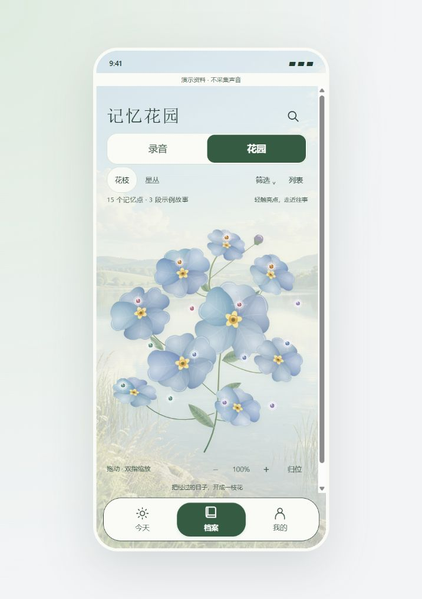

# v14 · 一簇可以生长的记忆

2026-10-02，继续修订本地网页原型。入口：[花园](prototype.html?demo=1#archive)、[首页](prototype.html?demo=1#home)。本轮未修改 Android/iOS 或共享 Contract，没有新增模型调用。

## 花形与参考

- [RHS：Myosotis sylvatica](https://www.rhs.org.uk/plants/41558/myosotis-sylvatica/details)：五裂小花、白色或黄色花心、灰绿色叶片，属的描述包含成簇开放。由此采用 **9 朵 × 5 瓣 = 45 片花瓣**，避免把单朵勿忘我变成重瓣大花。
- [Shirley Wu：Generative flower experiment #1](https://gist.github.com/sxywu/56728e6cf17ad249ef232c49cd9a90ad)：参考每瓣独立路径与角度扰动的思路。没有引入 D3/P5 或复制其代码。
- [Bloom](https://github.com/olavblj/bloom)：参考由种子稳定生成尺度、旋转与不对称的机制。该项目是几何插画；本原型并非其组件或摄影渲染。

`botanical-v14.js` 为原创 SVG 生成器，保留品牌 v2 的浅缺口语言。45 片独立三次曲线分别改变长度、两侧宽度、肩部、缺口和偏弯；每花另有大小、朝向及投影压缩。细小点纹用各瓣剪裁路径约束，加入瓣缘高光、根部阴影、分叉细脉、五瓣黄眼、未开花苞与有叶脉的叶片。主茎与每个花心相连，细分枝从共同茎部生出。它仍是植物插画风格，不宣称照片级拟真。

浏览器实际读取到 9 朵花、45 个独立花瓣路径，45 个路径均不同；15 个可交互亮点仍引用 E01–E03 原稿，装饰纹理不代表额外记忆。原有星丛视图保留。

## 占比与增长

花园工具合并为一行，主题筛选收进“筛选”面板；正文中的重复引导语隐藏。绘图区延伸至页面两侧，390px 手机画布下实测绘图区约 **376 × 418 CSS px**，原型存在滚动条时仍留出完整触控区域。拖动、缩放、列表、同源连线和场景返回沿用原路径。

加入每枝最多 15 个触控点的分枝浏览。数据超过 15 条时出现上一枝 / 下一枝，切枝归位并关闭旧浮窗。筛选保留原始分枝和槽位、隐藏空枝；追加数据不挪动已有点。当前演示只有 15 条，因此不显示无意义的分页控件。

这是原型的有界布局实现：稳定性以追加顺序为前提。真实服务接入时应持久化分枝/槽位与记忆 ID 的映射，再考虑按时间或故事分圃；不能直接用服务端重新排序后的数组索引。302 条仅用于自动测试，未混进演示内容，也未完成数百条真实内容的浏览器性能验收。

## 首页卡片

旧版四个圆角原本都是 26px，但 387px 高的卡片被屏幕滚动区截断，初始画面看到的是矩形裁切边。现在保留“继续核对”入口，最近记录展示另一条记录，去掉同一条桂花记录的重复展示；其余内容仍可在档案录音页查看。结合首屏间距调整，卡片约 231px 高，在 390 × 844 默认预览中四个圆角完整露出，距滚动区底部约 40px。

浅色卡片填充从 86% 降到 **68%**，约 32% 背景透入；深色为 74%。文字本身不降低透明度，次级文字与操作颜色加深，模糊从 9px 改为 7px。保留实色及系统减少透明度回退。以纯黑背景作为浅色最差合成情况，次级文字对比度约 4.65:1；深色叠纯白背景约 4.83:1。这是指定卡片底色与文字的保守计算，不代表全部页面重新完成色彩审计。

## 本轮验证

- `node --test docs/mobile-ui/memory-garden/garden.test.cjs docs/mobile-ui/memory-garden/imagery.test.cjs`：13/13 通过。增加 302 条增长测试，验证有界分枝、无丢失/重复、追加与筛选不改变旧槽位、空结果，以及各枝连线的同源约束。
- 浏览器：点亮 → 来源浮窗 → 回忆场景 → 返回；125% 缩放 / 归位；温暖筛选显示 3 个记忆点；清除后恢复 15 个。默认画布为 390 × 844，花瓣实际数量与路径差异已读取 DOM 确认。
- 窄视口实测约 325 × 844 CSS px，首页与花园无横向溢出；不要将工具传入尺寸当成浏览器实际 CSS 尺寸。
- 深色 + 200% 字号 + 减少动态：首页、花园及浮窗无横向溢出，云层动画为 none；实色选项返回不透明底与无模糊。大字号页面允许纵向滚动，不要求所有内容挤在一屏。
- 最终首页卡片填充 alpha 0.68，四角均 26px，底部实际落在滚动区内；最终花园标签无 error 日志。JavaScript 语法及 `git diff --check` 通过。

未进行原生移植、真机双指验收或真人音频处理全链路验收。此前本地未提交的原生改动保持不变。

