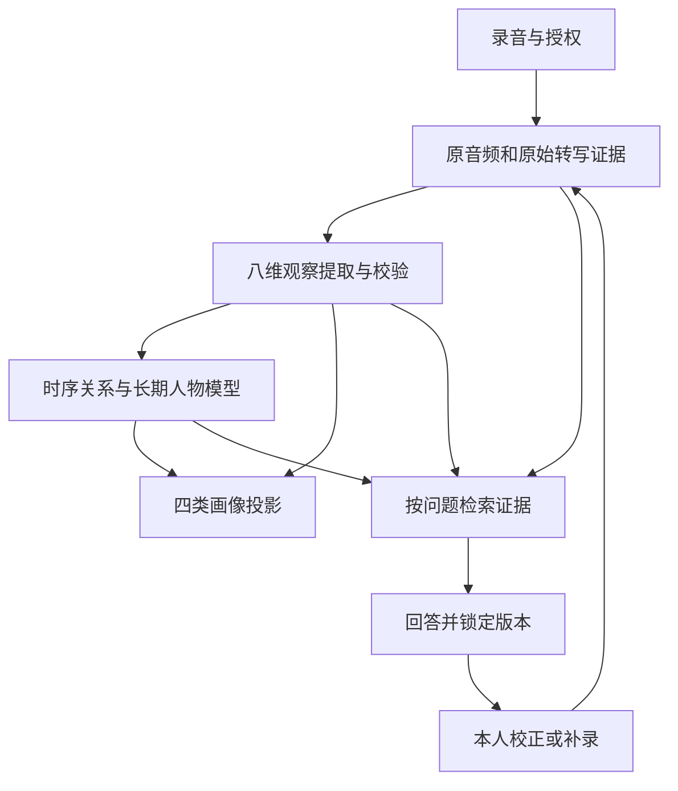

# 八维记忆与四类画像实施提案

日期：2026-10-08。状态：用户已授权执行本地实验版；设计及跨模块扩展仍待产品、AI Core、Backend、Android 联合评审。下列设计目标不等于全部已实现，实际交付范围见文末。

## 1. 结论与依据

采用“原始证据 → 八维记忆观察 → 时序关系/长期人物模型 → 四类画像视图 → 证据问答与本人校正”的分层结构。八类是默认的观察维度，可以配置启停、标签及展示顺序；不是八个独立数据库，也不要求每段录音凑齐八类输出。四类画像是可重建的派生视图，不替代原文和记忆。

继续一个主 LLM、顺序 schema workers、应用代码校验与写库。三个业务角色保留，不新增自主子 Agent、委派、模型工具执行或内容压缩。保留 Android/Kotlin/Compose 和电脑模式。

读取了申请书 18 页全文；第 3–4 页定义八类记忆，第 5 页是八类入口示意，第 6 页定义四种画像及超图，第 8 页定义三个角色，第 10–12 页强调原证据、校正和主动补问。第 10 页出现“十大”但无十类定义，本方案以用户本轮明确列出的八类及第 3–4 页为准。申请书补充产品目标，工程边界仍以当前用户指令和 PRD v3.0 为准。

申请书中的“滤镜”暂解释为叙事视角/情感着色，不直接当成图像滤镜检测或人格事实；不采用尚无验证依据的“完美复刻”或综合人格分数。这个解释是本提案的产品选择，待评审确认。

## 2. 实施前项目状态（2026-10-08 核对快照）

已 fetch 远端并只读检查代码，未切换分支或合并。

| 范围 | 核对版本 | 实际记忆处理 |
| --- | --- | --- |
| `origin/main` | `1c5c1795ad5e971c08d4ecfc68fa2255f5463d35` | Android `MockRememberMeRepository` 返回三条固定演示记忆；Memory 为日期、地点、story、people、tags、duration 等展示字段。AI Core/Backend 只有规划 README，没有真实处理实现。 |
| `origin/develop` | `4dc3d5a3f1d29ede9299259186b7b4aeb3421731` | 已有转写 → MemoryExtractor → schema/证据校验 → MemoryItem/Evidence 持久化 → PersonModelRepository 派生人物模型，以及中文语义检索代码。不能把这些算作 main 已有能力，也不能仅凭代码确认设备可运行。 |
| 当前 APK 所在分支 | `feature/ai-agent-core`，`8627f03` | 电脑模式有六类提取、证据、实验人物模型及问答校正；手机模式把 materials/traits/habits/calibrations/job 等存入 SQLite 的单份 JSON journal，原文直接参与理解和问答，尚无结构化八维记忆层。 |

main 的 shared Memory 枚举为 `EVENT / PERSON / RELATIONSHIP / PREFERENCE / VALUE / EMOTION`；PRD 的长期人物模型是七领域，两者都不等于申请书的八类观察。手机端目前的关联图连接本人、trait 与证据，尚不是申请书的四类画像；心理候选也只是其中一个派生结果。

手机端每次传入全部有效 materials，JSON 输入上限 60,000 字符；traits 每轮重建，长期身份连续性、事实级纠错和规模化检索仍需建设。此前提醒、关联图和心理候选只接入手机独立模式，电脑模式没有同等入口和执行能力。

还存在集成差异：develop 已保留并扩展 v0.1–v0.4 契约，当前实验分支使用 v0.1.2 加 `agent-loop-v0.2-experimental`。先审查各版本语义及已批准内容；不能把 develop 的旧客户端方向当作本轮 Android 基线，也不能覆盖其已有 Backend/AI Core 实现。

源码依据：

- [main Mock 仓库](https://github.com/ztjklt/Remember-Me/blob/1c5c1795ad5e971c08d4ecfc68fa2255f5463d35/apps/android/app/src/main/java/me/remember/app/data/mock/MockRememberMeRepository.kt)
- [main 契约](https://github.com/ztjklt/Remember-Me/blob/1c5c1795ad5e971c08d4ecfc68fa2255f5463d35/packages/contracts/schemas/integration-contract-v0.1.schema.json)
- [develop MemoryExtractor](https://github.com/ztjklt/Remember-Me/blob/4dc3d5a3f1d29ede9299259186b7b4aeb3421731/services/ai-core/app/extractor.py)、[人物模型](https://github.com/ztjklt/Remember-Me/blob/4dc3d5a3f1d29ede9299259186b7b4aeb3421731/services/backend/app/repositories/person_model.py)、[检索](https://github.com/ztjklt/Remember-Me/blob/4dc3d5a3f1d29ede9299259186b7b4aeb3421731/services/backend/app/retrieval.py)
- [手机本地引擎](../../apps/android/app/src/main/java/me/remember/app/data/local/LocalAgentEngine.kt)、[本地推理](../../apps/android/app/src/main/java/me/remember/app/data/local/LocalInference.kt)、[存储](../../apps/android/app/src/main/java/me/remember/app/data/local/LocalStorage.kt)

## 3. 借鉴 Memex 的具体机制

实际检查仓库提交 `4401c41603dcbf603b8e215ba4d7370b7773c954`，没有运行其 App。下列结论来自实现，非仅凭 README 推断。

| Memex 实现 | 本项目采用方式 |
| --- | --- |
| `MemorySyncService` 持久保存待处理 fact IDs，从 `card.fact` 读取原始输入，默认累计 5 条再触发 | 保留“原始输入与派生属性分层、任务可恢复”；改为每段录音即可入库并触发更新，不能等五段才展示。 |
| `MemoryAgent` 筛选长期身份、偏好、习惯，排除短暂情绪与一次性事件 | 只用于“升级为长期画像”的判定；事件与情绪仍进入我们的观察层，不能从人生记录中丢掉。 |
| `MemoryManagement` 的 `recent_buffer` 超过默认 10 条后，与 `archived_memory` 合并成画像摘要 | 不照搬有损合并、覆盖旧属性、移除短暂情绪的策略。用事实级 ADD/SUPPORT/CORRECT/CHANGE/CONFLICT 更新，保留引用和有效时间。 |
| SuperAgent 读取已有 memory；普通读取与明确写入请求分开 | 提问只检索和回答；新增录音、本人校正才写业务记忆。模型自己的回答不能反向成为用户证据。 |
| `SearchDao` 使用 SQLite FTS5，中文分词；`SearchService` 组合精确文本检索、FTS 和 card→PKM 关联 | 采用文本索引、中文召回、关系补齐的机制。Android 先做目标设备能力验证并提供兼容检索路径；不假定平台 SQLite 一定有 FTS5。复用 develop 的 Backend 检索实现边界。 |

Memex 的 append 路径主要保存 memory_id、content、source_agent、created_at，不能替代 Remember Me 的 Subject、Consent、原文 span、反证、revision 和删除级联模型。其个人资料记忆与角色/会话记忆是不同用途，本轮借鉴个人资料与原始记录处理，不把虚拟角色上下文当作本人经历。

源码：[同步队列](https://github.com/memex-lab/memex/blob/4401c41603dcbf603b8e215ba4d7370b7773c954/lib/data/services/memory_sync_service.dart)、[长期属性筛选](https://github.com/memex-lab/memex/blob/4401c41603dcbf603b8e215ba4d7370b7773c954/lib/agent/memory_agent/memory_agent.dart)、[记忆管理](https://github.com/memex-lab/memex/blob/4401c41603dcbf603b8e215ba4d7370b7773c954/lib/agent/memory/memory_management.dart)、[读写职责](https://github.com/memex-lab/memex/blob/4401c41603dcbf603b8e215ba4d7370b7773c954/lib/agent/skills/manage_memory/memory_management_skill.dart)、[全文索引](https://github.com/memex-lab/memex/blob/4401c41603dcbf603b8e215ba4d7370b7773c954/lib/db/daos/search_dao.dart)、[查询组合](https://github.com/memex-lab/memex/blob/4401c41603dcbf603b8e215ba4d7370b7773c954/lib/data/services/search_service.dart)。借鉴设计，保留自己的 Kotlin/Python 实现。

## 4. 八类记忆的可执行定义

一次讲述可产生多条原子观察；每条观察可以属于多个维度。只输出有依据的项目；“未检测”“证据不足”“不适用”有明确区分，不能自动补齐八类。

| 默认维度 | 提取内容与结构 | 首版输入与限制 | 画像用途 |
| --- | --- | --- | --- |
| 事件 `event` | 谁、何时、何地、做了什么、结果、时间精度、与其他事件关系 | 转写/本人校正；是“本人报告的事件”，不自动升级为 OBJECTIVE。计划、愿望与已发生事件区分。 | 事件流程图 |
| 情绪 `mood` | 情绪标签、强弱的自述或候选、触发事件、情绪主体、适用时间 | 逐语句保留标注位置，允许未知。区分“回忆当时的心情”和“现在讲述的心情”；文本与声学估计分别标源。 | 心情晴雨表 |
| 心理 `psychological` | 情境、评价/动机、应对方式、情绪变化、结果、候选模式 | 先提取明确自述；跨独立经历才形成待验证习惯。一段紧张经历不能自动成为焦虑人格。 | 决策价值、心情说明 |
| 滤镜 `narrative_frame` | 怀旧、美化、自我苛责、淡化、幽默化等叙事候选，附引用和解释 | 首版优先本人选择/确认；“追光、柔和、黑白”等作为展示标签映射，不能反过来证明情绪或事实真假。 | 心情变化注释、叙事视角 |
| 状态 `vocal_state` | 本人自述的疲惫/精神感受；有能力时增加响度相对值、语速、停顿等观测 | 自述与音频测量分开。首版不从分贝或所谓气流直接判定精神状态；没有音频能力时明确未检测。 | 语音状态附注、表达图 |
| 环境 `environment` | 自述地点/场景；可选的雨声、交通声、人声等音频事件和时间段 | 文本自述与音频识别分开。仅有 ASR 时不能声称识别了背景声，需独立 AudioObservation adapter。 | 事件上下文、表达环境 |
| 身份 IP `identity` | 身份、教育职业、重要关系、偏好、目标、价值观及其有效时间 | 拆成属性级记录，不能把姓名、学校、专业揉成一条不可局部修改的结论。 | 人物模型、决策价值 |
| 表达 `expression` | 用词、口头禅、句式、语气、叙事方式；可选语速/停顿 | 先分析转写可见特点，注明 ASR 可能改变标点/语气词；声音风格需音频依据，属于表达特征而非声音克隆。 | 表达方式图 |

`MemoryDimensionRegistry` 提案字段为 id、中文名称、定义、输入能力、输出校验规则、是否启用、画像目标、taxonomy_version。第一版内置八项，允许配置启停及标签；新维度须提供校验规则和样例，不能让 LLM 随意发明字段，也不先做任意插件执行平台。

七领域 Person Model 保留为长期理解的语义组织。八维是“观察什么”，七领域是“目前怎样理解这个人”，四图是“如何展示”。例如身份 IP 可关联身份、关系、偏好、价值观和决策领域；不做八类到七领域的一一硬映射。

## 5. 数据与更新结构

以下是待评审的内部概念，不是对现有 API 的直接扩字段：

| 层 | 核心字段/职责 |
| --- | --- |
| Episode / Evidence | subject、actor、consent、原录音、原转写、录音时间；证据指向 transcript span 或真实 audio interval；保留来源和说话人归属。 |
| MemoryObservation | observation_id、dimension_ids、claim/结构化内容、source_type、basis（自述/文本推断/音频观测）、evidence_ids、发生时间、讲述时间、情境、状态、模型/prompt/taxonomy 版本。 |
| PersonTrait / Relation | 稳定 trait_id、subject、domain、情境、有效时间区间、支持与反证；关系或超边连接事件、人物、观察和证据。 |
| PortraitSnapshot | portrait_type、memory_revision、person_revision、构建状态、图节点/边或序列点、对应 observation/trait/evidence IDs。 |
| Job / ChangeRecord | 输入 revision、阶段检查点、幂等键、ADD/SUPPORT/CORRECT/CHANGE/CONFLICT/RETRACT 及原因、失效依赖。 |

优先复用既有 Evidence、MemoryRepository、PersonModelRepository 和 revision 机制，避免创建并行的第二套业务存储。手机端将单份 journal 逐步迁入 SQLite 结构化表，Room 可作为访问实现选择，不能借此重写整个 App；先迁移和建立查询投影，再切换唯一写入源，避免长期双写。

事件时间 `event_at` 与录音时间 `recorded_at` 必须分开；“高考时紧张”不能记成今天情绪下降。原文 span 统一零起点 Unicode 码点、末端不包含，Kotlin/Python 用共同样例验证中文与 emoji。没有 ASR 对齐信息时 audio interval 留空，不能伪造逐句音频位置。

身份明确自述可立即形成自述属性；心理/偏好模式采用“单次观察 → 跨情境候选 → 本人确认/更多支持”，重复同段录音、其摘要和问答不能算三次独立证据。两段不同材料只是触发复核的参考门槛，不是心理结论已验证。

局部校正：只改姓名属性的有效理解，保留原错误转写及校正证据；学校、年级和研究方向继续有效。真正的职业变化则新增有效时间区间；不同情境的价值选择并存；无法解释的矛盾保留冲突并追问。

删除/撤回先立即排除来源，再清理或失效派生观察、trait、四图、检索索引、相关回答和缓存。历史快照不得绕过删除；任何“重建”都只能使用仍获授权的来源。模型回答不写回为本人事实。

申请书第 13 页另有限定：完整画像供本人检查；家属未来只能访问授权部分。检索和四图聚合前都按 Actor 的 grant scope 过滤，不能通过图中的数量或关联泄露未授权材料。Legacy 的人格封存沿用既定边界，本轮不实现传承功能，但数据更新入口需预留冻结检查。

## 6. 四类画像如何生成

| 视图 | 生成规则与最小界面 | 避免的失真 |
| --- | --- | --- |
| 事件流程图 | 事件时间线；时间不确定单独分组；节点含参与人、事件和结果；边标先后/本人明确因果/明确关联，点击查看原文。 | 先后不自动等于因果，叙述顺序不等于事件顺序，计划不当成已发生。 |
| 心情晴雨表 | 按适用日期展示本人自述或模型候选的情绪点/带；讲述时与回忆事件时可切换；心理变化、滤镜作为解释注释。 | 无材料日期留空；不把三类分数随意加权成健康值；同日冲突保留，不用一条曲线抹平。 |
| 决策与价值图 | 选择情境 → 可选项 → 本人选择 → 明确理由/价值取舍；跨事件汇总情境化候选，显示支持例子和反例。 | “喜欢乒乓球”只属于偏好，不能自动推出冒险程度或职业决策人格。 |
| 表达方式图 | 常见措辞/语气词及样本数、句式和风格例句；有音频对齐后增加语速/停顿；允许点回原句。 | 不凭 ASR 修整过的文字宣称测得声音风格，不展示无依据的人格雷达百分比。 |

四图都由代码把校验后的结构化记录变成可视化数据，LLM 负责提出语义候选，不自由生成图上的数值和关系。所有图标注版本、样本范围和构建失败/待更新状态。材料不足时可以空，用户知道缺什么后再决定是否补充。

超图先采用普通关系表或超边成员表实现：一条情境结论连接 Subject、相关事件、观察及全部证据。暂不引入图数据库和图神经网络。超图是追溯和检索能力，不能只绘制装饰性连线。

## 7. 单一 Agent 的执行与检索循环

1. 录音及授权先保存；ASR 成功即单独持久化原文。按保留偏移的语句/语义片段提取本次观察，不覆盖原文。
2. 一个主文字模型完成本次八维中可用的文本维度抽取；校验内容、来源、ID、时间、类型与引用。不要求每句一次调用，也不按八类调用八次模型。
3. 检索本次观察关联的旧实体、属性、校正与反证；再用同一模型提出增量人物模型变更，应用代码决定更新和状态。
4. 观察层提交成功后即为 `MEMORY_READY`，原文和事实问答可用；画像单独从 `BUILDING` 到 `READY`。画像失败显示重试和上次版本，不把已成功录音变成整体失败。
5. 画像更新绑定输入 memory_revision；新校正/删除使旧任务结果失效，不能发布过时视图。每个 Subject 串行执行，有检查点和幂等键。
6. 提问只构建本次 EvidencePack 并保存回答快照。姓名/身份类查询优先检索当前属性和相关本人校正；队友数量等枚举问题检索完整关系集合，不只取 top-k 后猜总数。
7. 一般查询结合中文文本检索、时间/人物/维度过滤及关系展开，补入关联校正和反证。最终引用必须落到原文或本人校正，不以画像摘要自证。
8. 检索选择完整相关证据片段，不做内容压缩或截掉半段原文；相关集合仍超出模型容量则分批检索、分页展示或说明当前回答范围，不假装覆盖全部材料。

手机首版可用 SQLite 全文索引加中文分词/字符召回与精确查询兜底；具体 FTS 版本以目标设备验证为准。Backend 优先适配已有检索器，保留可用性降级。Embeddings 与图数据库不作为第一版依赖；若将来引入向量召回，需通过漏召回、中文姓名和校正优先的同一验收集。

三个业务角色：Memory keeper 负责可关闭提醒与信息缺口问题建议，用户明确触发后才采集；Portrait reader 负责画像投影与来源解释；Psychological learner 只从有情境的观察更新习惯候选。提醒的缺口来自冲突/不确定性/本人标记的重要信息，不能只催用户把所有维度填满。

## 8. 手机和电脑模式的统一体验

一级入口建议为“录音、记忆、画像、问答、设置”。记忆页可按八维筛选，画像页有四个固定入口，角色名称及其职责在相应入口中解释；提醒入口放设置及录音页。角色没有独立聊天会话。

两种模式都使用同一套 UI 语义与版本/状态说明，由现有 Repository 装配不同数据源。页面持续显示当前资料来自“本机”或“电脑服务”；服务端暂不支持的能力显示明确状态，不能无提示隐藏或把远端资料交给本地推理。

新资料默认继续当前模式。已有电脑资料不会自动出现在手机；另列“导入已授权资料”作为独立后续任务，带 subject 映射、来源 ID 去重、同意范围检查。第一版不以自动同步作为依赖。

手机/电脑共享定义、JSON Schema、提示词语义和脱敏 golden fixtures，执行分别保留 Kotlin/Python。不要为了复用而在 Android 嵌入 Python，也不各自发明分类和校正规则。

## 9. 分批实施与验收

每批一个清晰关注点，稳定可验证后提交；PR 大小依逻辑拆分，不按文件机械切。本轮在已有 `feature/ai-agent-core` 的 `8627f03` 上继续用户授权的本地实验，不改写已发布历史，也未合并 develop 的不同契约。后续跨模块整合仍从 develop 开新分支并先审查契约。

| 顺序 | 交付范围 | 必须通过的验收 |
| --- | --- | --- |
| A：基线与语义 | main/develop/实验分支差异清单；八维定义、四图 DTO 草案、来源/校正/失效样例；提出共享契约 Issue | 三 owner 同意版本边界，旧 v0.1 schema 和 experimental 版本不动；两端消费同一例子含义一致。 |
| B：证据与结构化观察 | 单份 journal 渐进迁移、稳定观察 ID/维度标签、原文片段、局部校正、删除依赖；保持已有录音问答 | 升级前后原文/校正可读；失败回滚不丢资料；同一录音重试不重复；改姓名不丢其他身份事实。 |
| C：文本抽取和长期更新 | event/mood/identity/expression、明确心理变化；滤镜由本人确认；状态/环境先支持自述 | 一段普通自我介绍不硬生成情绪/心理结论；混合“我很累，同事要搬家”分别归属；真实文字 API 输出经 schema 和引用校验。 |
| D：检索问答 | 本地中文索引与原文召回、现有 Backend 检索适配、校正/反证补齐、关系枚举 | 姓名纠错后正确回答；队友人数与专业完整；长历史可定位旧事件；无证据不编造；第三方材料不改写本人的价值。 |
| E：四图和统一入口 | 四个画像视图、原文钻取、错误/空状态、模式和来源标识、修正入口 | 两模式入口可找到；每条结论/图点可定位证据；无数据日期不补曲线；校正和删除后四图、问答一致。 |
| F：音频增强与主动补问 | AudioObservation adapter 能力探测、音频片段关联、声音观测/环境事件；缺口驱动提醒 | ASR-only 模式明确未检测声音情绪/环境；真实手机验证权限、通知、重启和失败恢复；每个音频推断有原片段与模型版本。 |

第一轮可演示稳定版目标为 A–E：八维数据框架，主要文本维度有真实结果，四图有依据就展示，完成“录音 → 记忆 → 画像 → 问答 → 校正 → 更新”。F 单独验收；不得把模型填写了八个字段算作八种感知能力已完成。

建议评审测试集至少 20 段脱敏/合成材料、30 个问题，覆盖：自我介绍、人物关系、事件先后与计划、回忆情绪/当前心情、两次应对经历、明确价值选择、转述混合、重复录音、不同情境、事实纠错、真实变化、无相关材料、撤除和跨 Subject 访问。结构/引用/隔离/删除规则要求零违规；问答正确率及抽取精确度由人工标注评分后报告，不预先宣称达标。

两端执行同一语义 fixtures 和各自单元/集成检查；真实 ASR/LLM 使用独立脱敏样例。Android 按仓库 Gradle 全套命令验证，Backend/AI Core 改动时运行其全量 pytest。额外真机验收包括录音、数据迁移、SQLite 检索能力、页面路由、通知、进程重启、断网重试；编译通过不能代替这些项目。

职责：康欣 review 观察/画像/问答语义，王昊宇 review 持久化/检索/任务和失效，刘修贤 review Android/音频能力/页面，张天霁 review 分类产品含义、契约版本与验收。用户已授权执行，但不把此授权表述为 owner 批准、新 Phase Gate 或跨模块契约冻结。

## 10. 兼容与回滚

保留六类 Memory 输出作为旧消费者兼容面；八维观察新增在被批准的内部结构/版本化接口中，不把无法对应的音频或表达观察硬塞进旧枚举。不得借开放 metadata 暗中建立未经评审的跨模块标准。

保持 `integration-contract-v0.1*.json` 与 `agent-loop-v0.2-experimental` 原版本；先开 Issue/评审新投影，不在本提案中擅自命名或冻结下一个共享版本。
旧 journal 先备份并校验，再迁移；备份不含模型密钥，保持私有 no-backup，显式删除/清空同样清除相关恢复副本。关闭新能力时可回到原文和旧问答路径，不能静默销毁新数据或要求用户卸载应用。

## 本次交付范围

本次交付 Android `1.5-local` 实验 APK，基于现有 SQLite journal 附加字段，保留旧原文、理解、问答、校正与电脑模式。借鉴 Memex 的原文/派生分层和可恢复队列，自行实现 Kotlin 代码；未复制其源码、引入供应商 SDK 或新依赖。

| 项目 | 实际实现及边界 |
| --- | --- |
| 八维观察 | 内置八维定义，可启停；每条单维观察保留稳定 ID、原句、Unicode 码点 span、时间、来源及版本。同一句有多维内容时保存多条观察；标签/顺序暂不可编辑。声学状态和环境检测未实现，仅接受本人自述。 |
| 增量理解 | 保留无关旧属性，支持追加依据、局部校正、变化及冲突候选；同义事实尽量沿用 trait ID。没有完整的情境冲突检测或有效时间区间引擎。 |
| 检索 | 中文双字/英文词索引、完整片段、校正依赖补齐、枚举不固定 top-k；容量超限可操作提示。未做向量检索、时间筛选 UI、持久 FTS5 或压缩。 |
| 四图 | 事件日期排序、事件时/讲述时离散情绪点、明确决策与情境价值、表达例句及独立原文计数；每条可钻取原文。事件日期排序不推断因果，缺失材料允许空。 |
| 旧资料 | 显式重提取原转写，持久队列可重试；取消保留原文和完成观察。删除/撤除继续沿原文依赖失效观察与回答。未自动发送历史、导入电脑资料或同步。 |
| 电脑模式 | 同样可找到记忆/画像/问答入口，仅投影已有七领域及证据；八维服务端字段、端点和共享语义 fixtures 未实施，需另行 Issue 与契约评审。 |
| 存储/后续 | 保持单一 journal 写入源，无双写；结构化 SQLite 表迁移和跨模块 schema 留给独立评审。阶段 F 的声学增强与缺口提醒未实现；既有可关闭每日提醒保留。 |

实际执行的单元、完整回归、真实 ASR/LLM 验证及设备未执行项，以 [验证记录](../verification/ANDROID_MEMORY_PORTRAIT_2026_10_08.md) 为准。建议的 20 段/30 问人工评估集尚未完成，不能据当前冒烟测试宣称抽取质量或人格拟真度达标。shared contracts 和 experimental 版本未变。
